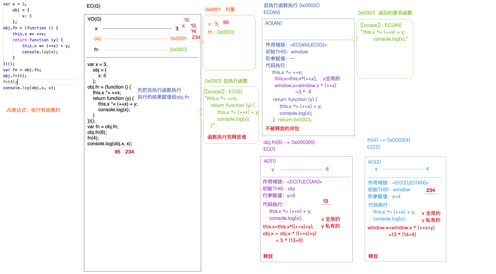

### 1.JS中的堆(Heap)栈(Stack)内存
栈内存 Stack：  
1.存储原始值类型值  
2.代码执行的环境  

堆内存 Heap：  
存储对象类型值

### 2.EC（Execution Context ） 
执行上下文：区分代码执行的环境

常见上下文分类：  
1.全局上下文 EC(G)：打开页面执行，全局上下文就会形成，只有当页面关闭才会释放  
2.函数私有上下文 EC(?)：一般函数(代码块)中的代码块执行完，浏览器会自动把私有上下文出栈释放  
3.块级私有上下文 EC(BLOCK)  

`注`：  
上下文：当前函数自己执行时产生的环境        
作用域：函数创建所在的环境

### 3.GO （Global Object）   
全局对象：通过window对象访问，是堆内存，存储内置的属性和方法 (alert、setTimeout、setInterval...)

### 4.VO(G)  （Varibale Object[G]）
全局变量对象：是一个栈内存 （当前上下文中，用来存储声明的变量的地方）

`注`：  
var、function => GO     
let、const、class => VO(G)      
使用一个变量 => VO(G) => GO => 如果都没有，则报未定义的错误

### 5.GC
浏览器垃圾回收机制:  
1.标记清楚（现代浏览器大多数采用这种方式）  
2.引用计数（因为存在循环引用的情况会导致内存无法释放，需要手动值为 null，因此大多数的浏览器已经放弃这种回收方式）

### 6.闭包      
闭包：是一种机制，函数执行产生一个私有的上下文，可以"保护"里面的变量不被外界干扰，防止全局变量污染，我们把函数执行的这种机制称为闭包

### 7.变量提升    
变量提升：在当前执行上下文中，代码执行前，浏览器会把带var、function关键字进行提前的声明和定义       
var：只会提前声明     
function：提前声明+定义(赋值)

### 8.强引用和弱引用        
强引用：堆被占用，不能释放这个堆      
弱引用：堆被占用，也能释放这个堆

### 9.暂时性死区        
基于typeof检测一个未被声明的变量，结果是undefined，不会报错
```js
/* 情况1 */
console.log(typeof x) // undefined

/* 情况2 */
console.log(typeof x) // 报错
let x = 1
```

### 10.回调函数  
**回调函数：把一个函数A作为实参，传递给另外一个执行的函数B「在B函数执行中，可以把A执行」**  
**回调函数：「自己定义的，自己没有调用，最后它执行了」**  
**例子：**  
  


### 11.装箱  
把原始值 => 实例对象  

### 12.拆箱   
实例对象 => 原始值  
