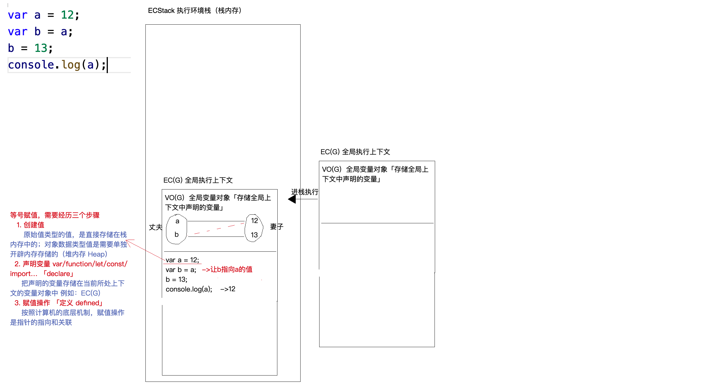
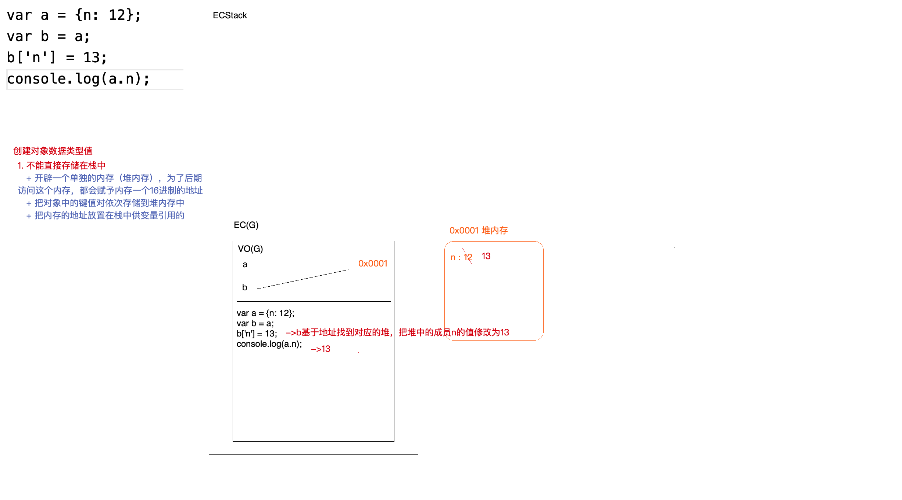
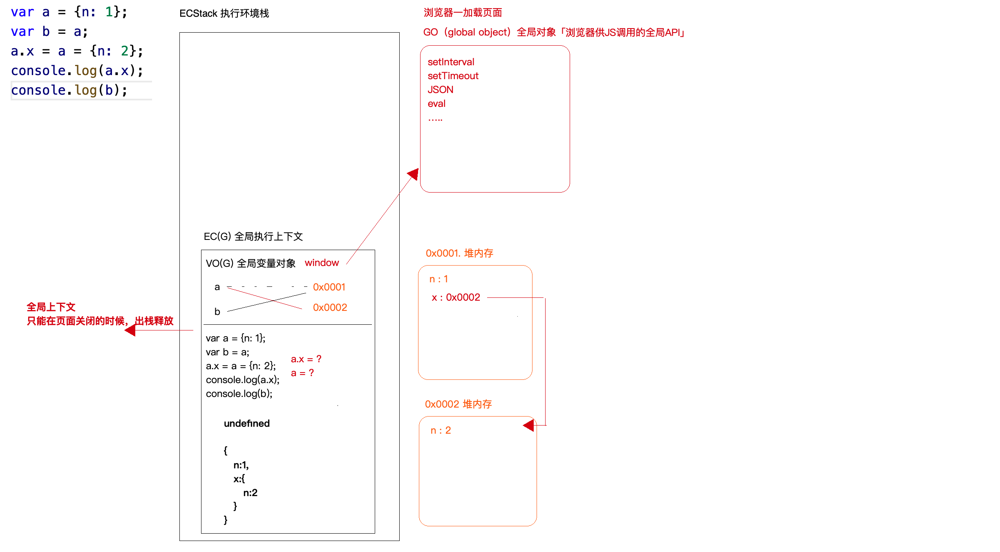
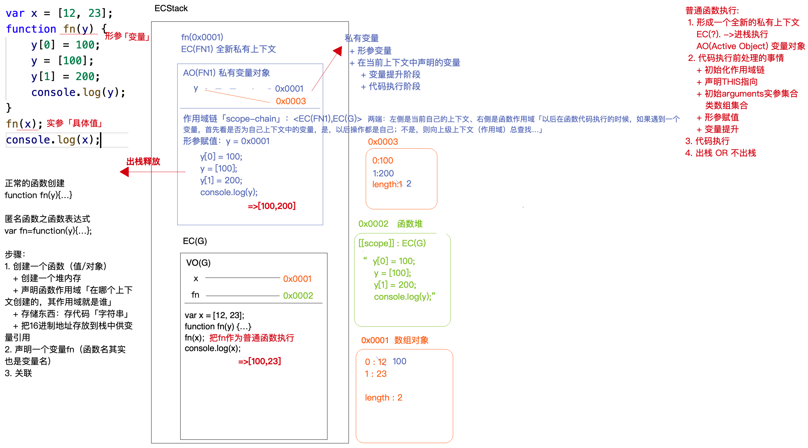

## 一、栈内存和堆内存
**1.JS运行的环境：**
  + 浏览器
  + webview  WebApp(Hybride混合APP) 
  + node.js
  + ...  

**2.浏览器能够运行JS代码，是因为提供了代码运行的环境：栈内存（Stack）**
  + 栈内存也是从计算机的内存分配出来的一块内存
  + 执行环境栈 E（execution）C（context）Stack  

**3.执行代码的过程中，为了区分是在哪个环境下执行（全局/函数/块...），首先会产生一个执行上下文：EC**
  + EC(G) 全局上下文，全局代码在这执行
  + EC(X) 某个函数的执行上下文

**例子1:**

**例子2:**

**例子3:**

## 二、函数执行上下文
**函数执行的上级上下文和函数在哪执行没有关系，只和它的作用域有关（作用域由创建函数时候的上下文决定）**

**例子1:**

