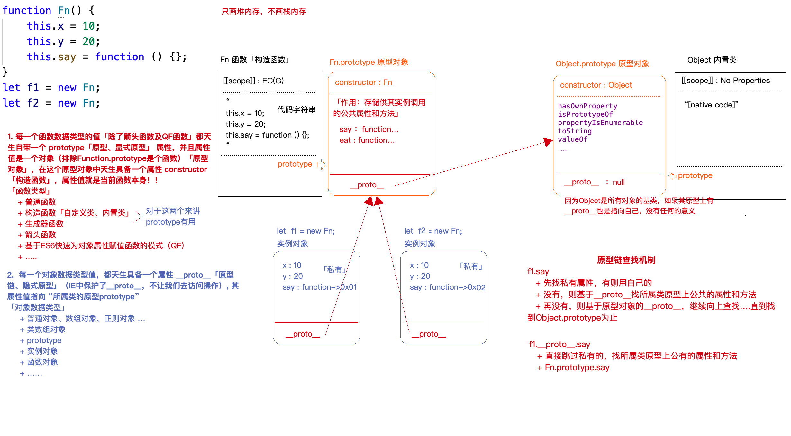
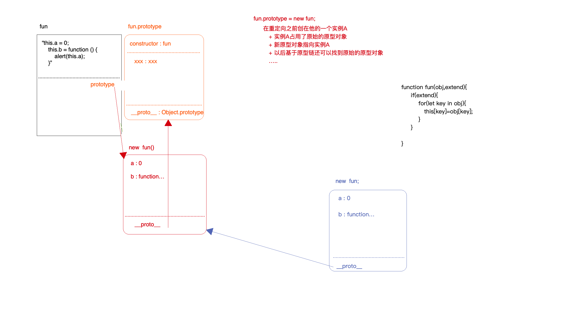

## 1-基本认识

**类「构造函数」 -> 所有的类都是函数数据类型的（包含内置类）**
- JS内置类 
    + Number  String  Boolean  Symbol  BigInt
    + Object
        + Object
        + Array
        + NodeList、HTMLCollection...
        + RegExp
        + Date
        + Set
        + Map
        + ...
    + Function 

- 自定义类「自己搞的类，和创建他的实例」
```js
    function Fn(x, y) {
        this.x = x;
        this.y = y;
    } 
    let f1 = new Fn(10, 20);
```

**所有的实例都是对象类型的「但是JS中有特殊性」**
- JS中创建值(实例)有两种方案：
   + 字面量方案  
   + 构造函数方案

`对于对象和函数类型来讲，两种方案除了语法上的区别，没有啥特别的不同；但是对于原始值类型，区别还是很大的「字面量方式返回的是原始值类型，但是构造函数方式返回的都是对象类型，但是都是所属类的实例」`

```js
    let n = 10; //原始值
    let m = new Number(10); //对象
    console.log(m.toFixed(2)); //->'10.00'
    console.log(n.toFixed(2)); //->'10.00'  浏览器默认会把“n”转换为“new Number(n)”对象类型的实例
    console.log(n - 10); //->0
    console.log(m - 10); //->0  浏览器会默认把对象转换为数字「Symbol.toPrimitive -> valueOf -> toString -> Number」 
```

**特殊的：Symbol / BigInt 是不允许被new的**

`想获取Symbol对应的对象类型值  => Object([value])获取当前[value]对应的对象类型值`

**new Fn  VS  new Fn()的区别**
- 第二个可以传递实参，第一个不能
- 运算符优先级的区别
     + new Fn()          20    
     + new Fn            19
     + 成员访问  obj.xx  20

**验证某个实例是否率属于这个类  instanceof**

**验证一个属性是否属于这个对象：attr in object**

**验证一个属性是否属于这个对象的私有属性：[object].hasOwnProperty([attr])**

**验证某个属性是否属于对象的公有属性「是它的属性，还不是私有的属性」**
```js
    弊端：某个属性既是私有的，也是公有的:
    function hasPubProperty(obj, attr) {
        return (attr in obj) && !obj.hasOwnProperty(attr);
    }
```
**手写hasPubProperty**
```js
Object.prototype.hasPubProperty = function hasPubProperty(attr) {
    let self = this,
        prototype = Object.getPrototypeOf(self)
    while (prototype) {
        if (prototype.hasOwnProperty(attr)) return true
        prototype = Object.getPrototypeOf(prototype)
    }
    return false
}

let A = Symbol('AA');
function Fn() {
    this.x = 100;
    this[A] = 100;
    this.getX = function () { };
}
Fn.prototype[A] = 1000;
Fn.prototype.getX = function () { };
let f1 = new Fn;

console.log(f1.hasPubProperty('x')); //->false
console.log(f1.hasPubProperty('getX')); //->true
console.log(f1.hasPubProperty(A)); //->true
console.log(f1.hasPubProperty('toString')); //->true   Object.prototype
```
## 2-new做了哪些事


```js
    // 手写new
    
    function Dog(name) {
        this.name = name;
    }
    Dog.prototype.bark = function () {
        console.log('wangwang');
    };
    Dog.prototype.sayName = function () {
        console.log('my name is ' + this.name);
    };
    
    let sanmao = _new(Dog, '三毛');
    sanmao.bark(); //=>"wangwang"
    sanmao.sayName(); //=>"my name is 三毛"
    console.log(sanmao instanceof Dog); //=>true */
    
    // es6写法
    function _new(Ctor, ...params) {
        if (typeof Ctor !== "function" || !typeof Ctor.prototype) throw new TypeError('Ctor is not a constructor')
        let obj = Object.create(Ctor.prototype),
            result = Ctor.call(obj, ...params)
        return typeof result === "function" || typeof result === "object" ? result : obj
    }
    
    // es5写法
    function _new(Ctor) {
        if (typeof Ctor !== "function" || !typeof Ctor.prototype) throw new TypeError('Ctor is not a constructor')
        var params = [].slice.call(arguments, 1),
            obj = Object.create(Ctor.prototype),
            result = Ctor.apply(obj, params)
        return typeof result === "function" || typeof result === "object" ? result : obj
    }
```

```js
    // 手写Object.create
    
    if (!Object.create) {
        // IE6~IE8
        Object.create = function (prototype) {
            if (!/^(object|function)$/i.test(typeof prototype)) throw new TypeError('Object prototype may only be an Object or null')
            function proxy() { }
            proxy.prototype = prototype
            return new proxy
        }
    }
```

## 3-构造函数和实例对象


## 4-重构原型对象
```js
function Fn(obj, extend) {
    if (extend) {
        for (let key in obj) {
            this[key] = obj[key];
        }
        return;
    }
    this.a = 100;
    this.b = function () {};
}
Fn.prototype.c = function () {};
Fn.prototype = new Fn({
    x: 100,
    getX: function () {}
}, true);
let f = new Fn;
```




## 5-assign
```js
    let obj1 = {
        n: 10,
        m: 20,
        header: {
            a: 100
        }
    };
    let obj2 = {
        x: 10,
        m: 30,
        header: {
            b: 200
        }
    }; 
    // obj2覆盖obj1
    // 只实现浅比较（浅合并）：只对第一级合并
    let obj = Object.assign(obj1, obj2);
    console.log(obj);
    console.log(obj === obj1); //true 返回的不是新对象，而是原始的obj1对象
    console.log(obj === obj2); //false 
    
    let obj = Object.assign({}, obj1, obj2);
    console.log(obj); //->返回的是第一个参数「也就是全新的一个对象」 
```

## 6-遍历对象
```js
    let obj = {
        name: 'zhufeng',
        age: 12,
        3: 200,
        0: 100,
        [Symbol('AA')]: function () {}
    };
      1. 优先遍历数字属性，而且按照从小到大遍历；数字属性遍历完，再去遍历其他的；
      2. 无法遍历Symbol的私有属性
      3. 遍历所属类原型上自定义的属性和方法「遍历了公有的：内置的是不可枚举的、自定义的属性是可枚举的」
    for (let key in obj) {
        if (!obj.hasOwnProperty(key)) break; //解决问题三 
        console.log(key, obj[key]);
    } 
    
    // 获取私有的属性：Object.keys(obj) OR Object.getOwnPropertyNames(obj)，返回包含所有非symbol私有属性的数组；
    // Object.getOwnPropertySymbols 获取所有的Symbol私有属性「数组」
    [
        ...Object.keys(obj),
        ...Object.getOwnPropertySymbols(obj)
    ].forEach(key => {
        console.log(key, obj[key]);
    }); 
    
    hasOwnProperty('xxx'));  只要私有有这个属性，结果就是true，也支持Symbol的私有属性检测
```

## 7-内置类的原原型上扩展方法
**在内置类的原原型上扩展方法** 
+ 调用起来方便，可以直接基于实例去调用方法，方法中的this就是实例「也就是我们要操作的值」
+ 可以实现链式调用
+ 自己扩展的方法最好设置前缀“myXxx”，防止自己扩展的方法覆盖原始内置的方法
```js
    function checkVal(val) {
        val = + val
        return isNaN(val) ? 0 : val
    }
    
    Number.prototype.plus = function plus(val) {
        val = checkVal(val)
        return this + val
    }
    
    Number.prototype.minus = function plus(val) {
        val = checkVal(val)
        return this - val
    }
    
    let n = 10;
    let m = n.plus(10).minus(5);
    console.log(m); // 15

```

## 8-函数的多种角色

**函数的多种角色**
 + 函数
    + 普通函数「闭包作用域」
    + 构造函数「类、实例」
    + 生成器函数
 + 对象


 ## 9-基于class创建类
 ```js
    function Fn(x) {
        this.x = x;
        this.y = 200;
    }
    Fn.prototype.z = 300;
    Fn.prototype.getX = function () {};
    Fn.m = 400;
    Fn.getM = function () {};
    
    Fn.getM();
    Fn(100);
    new Fn(100);
    
    class Fn {
        constructor(x) {
            this.x = x;
            // this.y = 200;
        }
        y = 200; //ES7: this.y = 200 设置的是私有的属性
    
        //---- Fn.prototype
        getX() {} //该函数没有prototype
    
        //---- 设置静态私有属性方法
        static m = 400;
        // static getM = function () {} //该函数有prototype
        static getM() {} //该函数没有prototype
    }
    Fn.prototype.z = 300; //公有的属性只能外侧单独加
    
    // Fn(); //=>Uncaught TypeError: Class constructor Fn cannot be invoked without 'new' 基于class创建的类只能被new执行
    // console.log(Fn.getM);
    let f = new Fn(100);
    console.log(f); 
    
    let obj = {
        fn: function () {}, //该函数有prototype
        fn() {} //该函数没有prototype
    };
```

## 10-继承
**1-原型继承**


**2-call继承**


**3-寄生组合式继承**


**4-ES6类继承**

