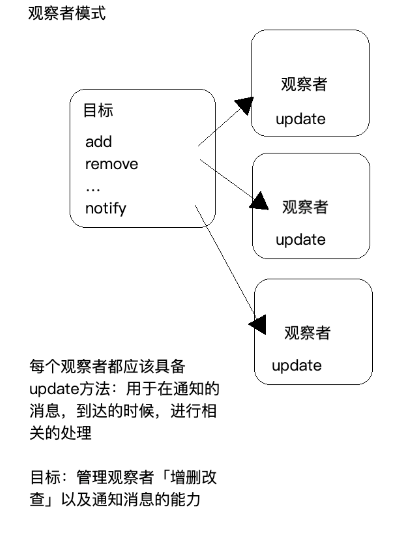
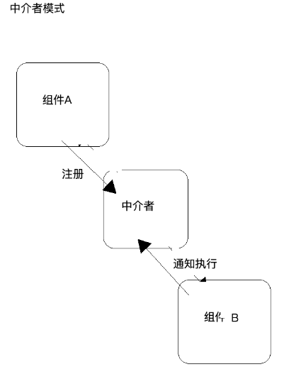

**设计模式是一种思想：让代码更整洁、清晰、易于维护、扩展等**

## 1-单例模式
**单例模式：既有自己私有的属性方法，也可以暴露出方法给其他模块使用**
```js
// 程序员A开发的-模块A
var AModule = (function () {
    var data = [];

    function bindHTML() {
        // ...
    }

    function change() {
        // ...
    }

    return {
        change: change
    };
})();

// 程序员B开发的-模块B
var BModule = (function () {
    var data = [];

    function bindHTML() {
        // ...
    }

    AModule.change();

    return {
        bindHTML: bindHTML
    };
})();
```

```js
// 业务来讲：按照一定的顺序依次执行对应的方法，从而实现整个板块功能的开发
let SearchModule = (function () {
    let body = document.body;

    function queryData() {}

    function bindHTML() {}

    function handle() {}

    return {
        // init相当于大脑，可以控制谁先执行，谁后执行 「命令模式」
        init: function () {
            queryData();
            bindHTML();
            handle();
        }
    };
})();
SearchModule.init(); 
```

## 2-Constructor构造器模式
**构造器模式：区分公有和私有，一般用于插件、组件、类库、框架的封装**
```js
class AModule {
    constructor() {
        // this->每个类的实例
        this.arr = [];
    }
    // 原型上 公共的属性和方法
    change(val) {
        this.arr.push(val);
        console.log(this.arr);
    }
}

let A1 = new AModule;
let A2 = new AModule;
console.log(A1, A2);
console.log(A1 === A2); //->false
console.log(A1.arr === A2.arr); //->false
console.log(A1.change === A2.change); //->true
A1.change(10);
A2.change(20); 
```

## 3-Factory工厂模式
**工厂模式：帮助我们实现调用的切换，或实现一些中转的处理，相当于中转站**

```js
function factory(options) {
    options = options || {};
    let {
        type,
        payload
    } = options;
    if (type === 'array') {
        // 执行A，完成一个逻辑
        return;
    }
    // 执行B，完成另外的逻辑
}
factory({
    type: 'array',
    payload: 100
});

factory({
    type: 'object',
    payload: 'zhufeng'
}); 
```

```js
(function () {
    var jQuery = function (selector, context) {
        // 创建init类的实例
        return new jQuery.fn.init(selector, context);
    };
    jQuery.fn = jQuery.prototype = {
        // ...
    };

    // 需要工厂的转换
    var init = jQuery.fn.init = function (selector, context, root) {};
    init.prototype = jQuery.fn;

    window.$ = jQuery;
})();
$('xxx'); //-> jQuery('xxx') 创建JQ类的实例，调取jQuery.fn原型上的方法 
```

## 4-Observer观察者模式
**观察者模式：观察者模式由具体目标调度，每个被订阅的目标里面都需要有对观察者的处理，会造成代码的冗余？？？**
```js
class Observer {
    update(message) {
        // 消息触达，通知update执行
        console.log('消息接收！', message);
    }
}
class Demo {
    update(message) {
        console.log('消息接收！', message);
    }
}

//目标
class ObserverList {
    constructor() {
        this.observerList = [];
    }
    add(observer) {
        this.observerList.push(observer);
        return this;
    }
    remove(observer) {
        this.observerList = this.observerList.filter(ob => ob !== observer);
        return this;
    }
    get(index) {
        return this.observerList[index];
    }
    count() {
        return this.observerList.length;
    }
}
class Subject {
    observers = new ObserverList;
    add(observer) {
        this.observers.add(observer);
    }
    remove(observer) {
        this.observers.remove(observer);
    }
    notify(...params) {
        for (let i = 0; i < this.observers.count(); i++) {
            let item = this.observers.get(i);
            item.update(...params);
        }
    }
}

let sub = new Subject;
sub.add(new Observer);
sub.add(new Observer);
sub.add(new Demo);
setTimeout(() => {
    sub.notify('通知相应的update执行！');
}, 1000);
```


## 5-Mediator中介者模式

**中介者模式：都是通过中介者来进行注册和发布的**
```js
// 中介者
let mediator = (function () {
    let topics = {};

    // 订阅：订阅A组件中的某个方法
    let subscribe = function subscribe(topic, callback) {
        !topics[topic] ? topics[topic] = [] : null;
        topics[topic].push({
            context: this,
            callback
        });
    };

    // 发布：B组件中到某个阶段，可以通知之前订阅的方法执行
    let publish = function publish(topic, ...params) {
        if (!topics[topic]) return;
        topics[topic].forEach(item => {
            let {
                callback,
                context
            } = item;
            callback.call(context, ...params);
        });
    };
    
    return {
        subscribe,
        publish
    };
})();
```


## 6-发布订阅模式
**发布订阅模式：发布订阅模式有个事件调度中心，消除了发布者和订阅者之间的依赖。**
```js
class EventEmitter {
    constructor() {
        this.event = this.event || new Map
    }
    addListener(type, fn) {
        if (!this.event.get(type)) {
            this.event.set(type, fn)
        }
    }
    emit(type) {
        let handle = this.event.get(type)
        if (typeof handle === 'function') {
            handle.apply(this, [...arguments].slice(1))
        }
    }
}

let emitter = new EventEmitter
emitter.addListener('change', change => {
    console.log(change)
})
emitter.emit('change', 111)
```

## 7-装饰器模式
**装饰器模式：为对象添加新功能，不改变其原有的结构和功能**
```js
class Circle {
    draw() {
        console.log('画一个圆形');
    }
}

class Decorator {
    constructor(circle) {
        this.circle = circle;
    }
    draw() {
        this.circle.draw();
        this.setRedBorder(circle);
    }
    setRedBorder(circle) {
        console.log('设置红色边框')
    }
}

// 测试
let circle = new Circle();

let client = new Decorator(circle);
client.draw();
```