## 1.谈谈你对MVVM的理解

MVVM是 Model-View-ViewModel的缩写，即模型-视图-视图模型。MVVM 是一种设计思想。

- 模型（Model）： 数据保存—存放着各种数据，有的是固定写死的，大多数是从后端返回的数据
- 视图 （View）：用户界面，也就是DOM
- 视图模型（View-Model）:连接View和Model的桥梁，当数据变化时，ViewModel够监听到数据的变化（通过Data Bindings），自动更新视图，而当用户操作视图，ViewModel也能监听到视图的变化（通过DOM Listeners），然后通知数据做改动，这就实现了数据的双向绑定。

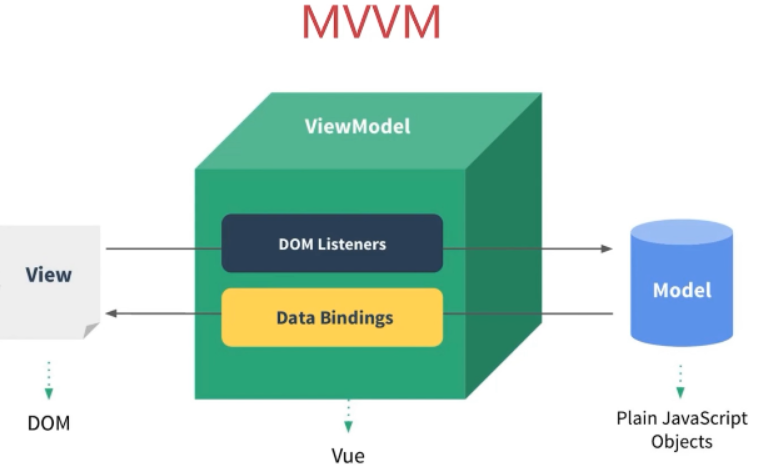

**MVVM和 MVC 区别**
- 都是一种设计思想
- MVC 后台用的多，MVC是Model-View-Controller的简写，即模型-视图-控制器。
- MVC的目的就是将M和V 的代码分离
- MVC是单向通信，也就是View和Model，必须通过Controller来承上启下
- MVC对于前端而言，数据变化无法同步到视图中。需要将逻辑聚拢在controller
层
- MVVM实现了View和Model的自动同步，当Model的属性改变时，不用再自己手动操作DOM元素，提高了页面渲染性能

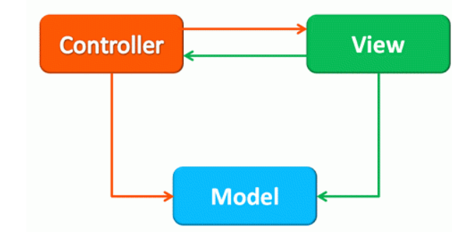


## 2.请说一下Vue响应式数据的理解
- 数组和对象类型当值变化时如何劫持到。对象内部通过 defineReactive 方法，使用Object.defineProperty 将属性进行劫持（只会劫持已经存在的属性），数组则是
通过重写数组方法来实现。 多层对象是通过递归来实现劫持。 Vue3 则采用proxy

`src/core/observer/index.js:135`

```js
// *****************Vue2***************
function observer(value) { // proxy reflect
    if (typeof value === 'object' && typeof value !== null)
        for (let key in value) {
            defineReactive(value, key, value[key]);
        }
}

function defineReactive(obj, key, value) {
    observer(value);
    Object.defineProperty(obj, key, {
        get() { // 收集对应的key 在哪个方法（组件）中被使用
            return value;
        },
        set(newValue) {
            if (newValue !== value) {
                observer(newValue);
                value = newValue; // 让key对应的方法（组件重新渲染）重新执行
            }
        }
    })
}
let obj1 = { school: { name: 'zf', age: 12 } };
observer(obj1);
console.log(obj1)

// *****************Vue3***************
let handler = {
    set(target, key, value) {
        return Reflect.set(target, key, value);
    },
    get(target, key) {
        if (typeof target[key] == 'object' && target[key] !== null) {
            return new Proxy(target[key], handler); // 懒代理[取值的时候是对象才进行代理]
        }
        return Reflect.get(target, key);
    }
}
let obj2 = { school: { name: 'zf', age: 12 } };
let proxy = new Proxy(obj2, handler);
```

## 3.Vue中如何检测数组变化
- 数组考虑性能原因没有用 defineProperty 对数组的每一项进行拦截，而是选择重写
- 数组（ push,shift,pop,splice,unshift,sort,reverse ）方法。
- 数组中如果是对象数据类型也会进行递归劫持
- 数组的索引和长度变化是无法监控到的

`src/core/observer/index.js:47`
`src/core/observer/array.js:11`

```js
let oldArray = Object.create(Array.prototype);
['shift', 'unshift', 'push', 'pop', 'reverse','sort'].forEach(method => {
    oldArray[method] = function() { // 这里可以触发页面更新逻辑
        console.log(method)
        Array.prototype[method].call(this,...arguments);
    }
});
let arr = [1,2,3];
arr.__proto__ = oldArray;
arr.unshift(4);
```

## 4.Vue中如何进行依赖收集
- 一个组件就是一个watcher，watcher中放渲染函数
- 默认在初始化时会调用render函数，此时会触发属性依赖收集 dep.depend
- 当属性发生修改时会触发 watcher 更新 dep.notify()
- 一个属性一个dep，一个属性可以对应多个watcher(一个属性在多个组件中使用)
- 一个watcher可以对应多个属性，dep和watcher是多对多的关系

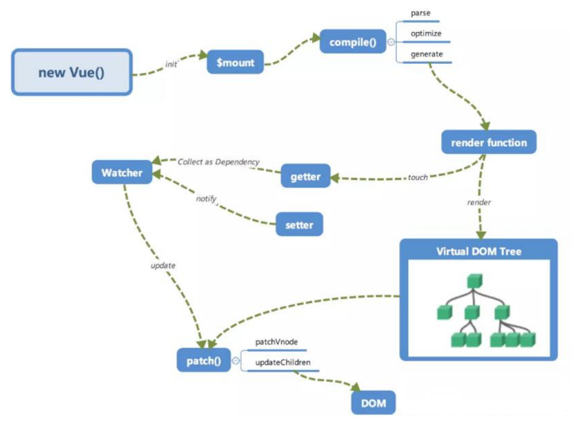
```js
// 观察者模式

let obj = { name: 'zf', age: 12 };

class Dep {
    constructor() {
        this.subs = [] // subs [watcher]
    }
    depend() {
        this.subs.push(Dep.target)
    }
    notify() {
        this.subs.forEach(watcher => watcher.update())
    }
}
Dep.target = null;
observer(obj); // 响应式属性劫持

// 渲染组件时 会创建watcher
class Watcher {
    constructor(render) {
        this.get();
    }
    get() {
        Dep.target = this;
        render(); // 执行render
        Dep.target = null;
    }
    update() {
        this.get();
    }
}
const render = () => {
    console.log(obj.name); // obj.name => get方法
}
new Watcher(render);

function observer(value) { // proxy reflect
    if (typeof value === 'object' && typeof value !== null)
        for (let key in value) {
            defineReactive(value, key, value[key]);
        }
}
function defineReactive(obj, key, value) {
    let dep = new Dep();
    observer(value);
    Object.defineProperty(obj, key, {
        get() { // 收集对应的key 在哪个方法（组件）中被使用
            if (Dep.target) { // watcher
                dep.depend(); // 这里会建立 dep 和watcher的关系
            }
            return value;
        },
        set(newValue) {
            if (newValue !== value) {
                observer(newValue);
                value = newValue; // 让key对应的方法（组件重新渲染）重新执行
                dep.notify()
            }
        }
    })
}
obj.name = 'jw'

```

## 5.如何理解Vue中模板编译原理
**问题核心：如何将template转换成render函数 ?**
1. 第一步是将 模板字符串 转换成 element ASTs（解析器）
2. 第二步是对 AST 进行静态节点标记，主要用来做虚拟DOM的渲染优化（优化器） 静态节点跳过 diff 操作
3. 第三步是 使用 element ASTs 生成 render 函数代码字符串（代码生成器）

解析器（parser）的原理是一小段一小段的去截取字符串，然后维护一个 stack 用来保存DOM深度，每截取到一段标签的开始就 push 到 stack 中，当所有字符串都截取完之后也就解析出了一个完整的 AST。

优化器（optimizer）的原理是用递归的方式将所有节点打标记，表示是否是一个 静态节点，然后再次递归一遍把 静态根节点 也标记出来。

代码生成器（code generator）的原理也是通过递归去拼一个函数执行代码的字符串，递归的过程根据不同的节点类型调用不同的生成方法，如果发现是一颗元素节点就拼一个 _c(tagName, data, children) 的函数调用字符串，然后 data 和 children 也是使用 AST 中的属性去拼字符串。  
如果 children 中还有 children 则递归去拼。  
最后拼出一个完整的 render 函数代码。

`src/compiler/index.js:11`

## 6.Vue生命周期钩子是如何实现的
- Vue的生命周期钩子就是回调函数而已，当创建组件实例的过程中会调用对应的钩子
方法。
- 内部会对钩子函数进行处理，将钩子函数维护成数组的形式，最后依次执行

`src/core/instance/init.js:38 初始化合并`
`src/core/util/options.js:388 合并选项`
```js
function mergeHook (
  parentVal: ?Array<Function>,
  childVal: ?Function | ?Array<Function>
): ?Array<Function> {
  const res = childVal // 儿子有
    ? parentVal
      ? parentVal.concat(childVal) // 父亲也有，那就是合并
     : Array.isArray(childVal) // 儿子是数组
        ? childVal
       : [childVal] // 不是数组包装成数组
   : parentVal
  return res
    ? dedupeHooks(res)
   : res
}
```

## 7.Vue的生命周期方法有哪些？一般在哪一步发送请求及原因
**在哪发送请求都可以，主要看具体你要做什么事**
- `beforeCreate` 在实例初始化之后，数据观测(data observer) 和 event/watcher 事件配置之前被调用。
- `created` 实例已经创建完成之后被调用。在这一步，实例已完成以下的配置：数据观
测(data observer)，属性和方法的运算， watch/event 事件回调。这里没有$el
- `beforeMount` 在挂载开始之前被调用：相关的 render 函数首次被调用。
- `mounted` el 被新创建的 vm.$el 替换，并挂载到实例上去之后调用该钩子。
- `beforeUpdate` 数据更新时调用，发生在虚拟 DOM 重新渲染和打补丁之前。
- `updated` 由于数据更改导致的虚拟 DOM 重新渲染和打补丁，在这之后会调用该钩
子。
- `beforeDestroy` 实例销毁之前调用。在这一步，实例仍然完全可用。
- `destroyed` Vue 实例销毁后调用。调用后，Vue 实例指示的所有东西都会解绑定，所有的事件监听器会被移除，所有的子实例也会被销毁。 该钩子在服务器端渲染期间不被调用。
- `keep-alive` (activated 和 deactivated)

## 8.Vue.mixin的使用场景和原理
- Vue.mixin 的作用就是抽离公共的业务逻辑，原理类似“对象的继承”，当组件初始化时会调用 mergeOptions 方法进行合并，采用策略模式针对不同的属性进行合并。如果混入的数据和本身组件中的数据冲突，会采用“就近原则”以组件的数据为准。
- mixin中有很多缺陷 "命名冲突问题"、"依赖问题"、"数据来源问题"

`src/core/global-api/mixin.js`

## 9.Vue组件data为什么必须是个函数
- 每次使用组件时都会对组件进行实例化操作，并且调用data函数返回一个对象作为组
件的数据源。这样可以保证多个组件间数据互不影响
```js
// 组件的渲染流程 调用Vue.component -> Vue.extend -> 子类 -> new 子类
// Vue.extend 根据用户定义产生一个新的类
function Vue() {}
function Sub() { // 会将data存起来
    this.data = this.constructor.options.data();
}
Vue.extend = function(options) {
    Sub.options = options; // 静态属性
    return Sub;
}
let Child = Vue.extend({
    data:()=>( { name: 'zf' })
});

// 两个组件就是两个实例, 希望数据互不感染
let child1 = new Child();
let child2 = new Child();

console.log(child1.data.name);
child1.data.name = 'jw';
console.log(child2.data.name);

// 根组件不需要任何的合并操作，根才有vm属性，所以他可以是函数和对象
// 但是组件 mixin 他们都没有 vm 所以就需要判断当前data是不是个函数
```

## 10.nextTick在哪里使用？原理是?
- nextTick 中的回调是在下次 DOM 更新循环结束之后执行的延迟回调。
可用于获取更新后的 DOM。
- Vue中数据更新是异步的，使用 nextTick 方法可以保证用户定义的逻辑在更新之后
执行。
- 是将内容维护到一个数组里，最终按照顺序执行。 第一次会开启一个异步任务(渲染页面的时候)，后面都是同步的

`src/core/util/nextTick.js:89`

## 11.computed和watch区别
- computed和watch都是基于Watcher来实现的
- computed属性是具备缓存的，依赖的值不发生变化，对其取值时计算属性方法不会
重新执行
- watch则是监控值的变化，当值发生变化时调用对应的回调函数
- 渲染 Watcher/compoted Watcher/用户 Watcher

`src/core/instance/state.js:58`

`src/core/instance/state.js:241 计算属性取值函数`

`src/core/instance/state.js:345 watch的实现`

## 12.Vue.set方法是如何实现的
- 我们给对象和数组本身都增加了 dep 属性
- 当给对象新增不存在的属性则触发对象依赖的watcher去更新，并把属性添加到响应式数据中
- 当修改数组索引时我们调用数组本身的splice方法去更新数组

`src/core/observer:45 给对象增加 dep 属性`
`src/core/observer:201 set 方法的定义`

## 13.Vue为什么需要虚拟DOM
- Virtual DOM就是用`js`对象来描述真实DOM，是对真实DOM的抽象
- 频繁操作真实DOM，回流重绘，性能消耗大
- 由于直接操作DOM性能低但是`js`层的操作效率高，可以将DOM操作转化成对象操
作，最终通过diff算法比对差异进行更新DOM（减少了对真实DOM的操作）。
- 虚拟DOM不依赖真实平台环境从而也可以实现跨平台。

`scr/core/vdom/create-element.js:28`

`src/core/vdom/vnode.js 虚拟节点的实现`

## 14.Vue中diff算法原理
- Vue的 diff 算法是平级比较，不考虑跨级比较的情况。内部采用深度递归的方式 + 双指针的方式进行比较。
    1. 先比较是否是相同节点 key tag
    2. 相同节点比较属性,并复用老节点
    3. 比较儿子节点，考虑老节点和新节点儿子的情况
    4. 优化比较：头头、尾尾、头尾、尾头
    5. 比对查找进行复用
- Vue3中采用最长递增子序列来实现 diff 优化

`src/core/vdom/patch.js :700`

`src/core/vdom/patch.js :501 比较两个虚拟节点 patchVnode()`

`src/core/vdom/patch.js :404 比较两个虚拟节点 patchChildren()`

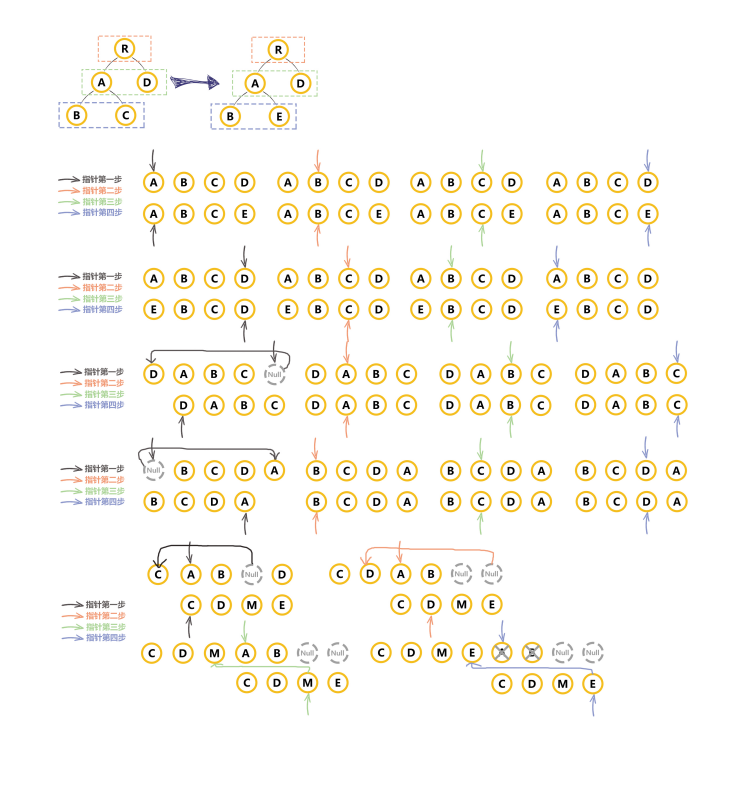

## 15.Vue通过数据劫持可以精准探测数据变化，为什么用虚拟DOM进行diff检测差异
- 响应式数据变化，Vue确实可以在数据发生变化时,响应式系统可以立刻得知。但是如果给每个属性都添加watcher用于更新的话，会产生大量的watcher从而降低性能。
- 而且粒度过细也会导致更新不精准的问题，所以vue采用了组件级的watcher配合diff
来检测差异。

## 16.请说明Vue中key的作用和原理，谈谈你对它的理解
- Vue在patch过程中通过key可以判断两个虚拟节点是否是相同节点。（可以复用老节点）
- 无key会导致更新的时候出问题
- 尽量不要采用索引作为key

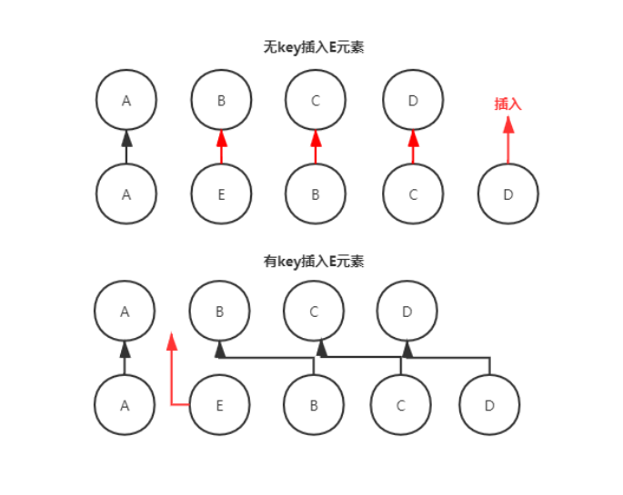

## 17.谈一谈对Vue组件化的理解
- 组件化开发能大幅提高应用开发效率、测试性、复用性等; 
- 常用的组件化技术：属性、自定义事件、插槽等
- 降低更新范围，只重新渲染变化的组件
- 组件的特点：高内聚、低耦合、单向数据流

## 18.Vue的组件渲染流程
1. 创建组件虚拟节点
    - 组件增加init初始化生命周期
    - Vue.extend() => 组件的构造函数
    - 初始化组件的钩子方法(init/prepatch/insert/destroy)
2. 创建组件的真实节点
    - 调用 init 方法
    - new 组件
    - 调用 $mount 产生 $el
3. 插入到页面中

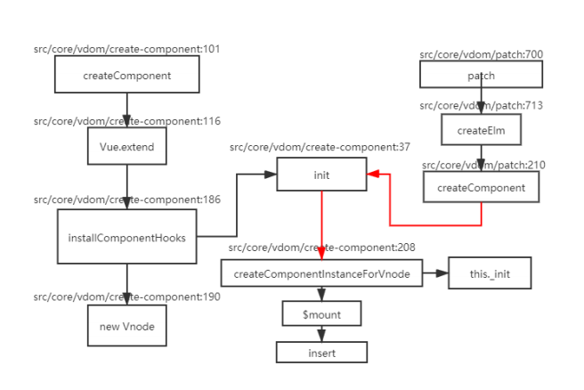

## 19.Vue组件更新流程
属性更新时会触发 patchVnode 方法 -> 组件虚拟节点会调用 prepatch 钩子 -> 更新属性 -> 组件更新

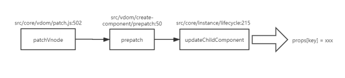

## 20.Vue中异步组件原理
默认渲染异步占位符节点 -> 组件加载完毕后调用 forceUpdate 强制更新

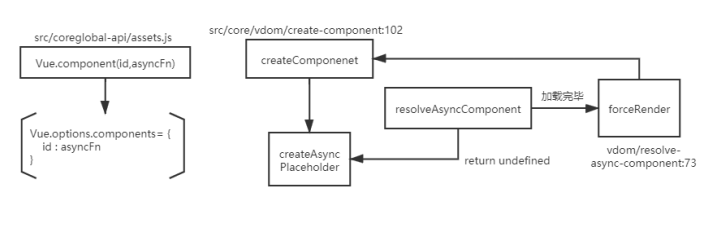

## 21.函数组件的优势及原理
- 函数式组件的特性：无状态data、无生命周期、无this，但是性能高。正常组件是一个类继承了Vue， 函数式组件就是普通的函数，没有new的过程，也没有 init、prepatch
- 就是一个构造函数产生虚拟节点

`src/vdom/create-component.js:163`

## 22.Vue组件间传值的方式及之间区别
- props 和 $emit 父组件向子组件传递数据是通过prop传递的，子组件传递数据给父组件是通过$emit触发事件来做到的
- $parent , $children 获取当前组件的父组件和当前组件的子组件
- $attrs(属性) 和 $listeners(方法) A->B->C。Vue 2.4 开始提供了 $attrs 和 $listeners 来解决这个问题
- 父组件中通过 provide 来提供变量，然后在子组件中通过 inject 来注入变量。
- $refs 获取实例
- envetBus 平级组件数据传递 这种情况下可以使用中央事件总线的方式
- vuex 状态管理

## 23.$attrs是为了解决什么问题出现的，provide和inject不能解决它能解决的问题吗？ v-bind="$attrs" v-on="$listeners"
$attrs 主要的作用就是实现批量传递数据。provide/inject更适合应用在插件中，
主要是实现跨级数据传递

## 24.v-if和v-for哪个优先级更高？
- v-for和v-if不要在同一个标签中使用,因为解析时先解析v-for在解析v-if。如果遇到需要同时使用时可以考虑写成计算属性的方式。

`src/compiler/index.js:19`
`src/compiler/codegen/index.js::56 解析v-if 和 v-for`

## 25.v-if，v-model，v-for的实现原理
v-for 实现原理 `src/compiler/codegen/index.js:187`

v-if 实现原理 `src/compiler/codegen/index.js:147`

普通元素上的v-model指令：`src/compiler/codegen/index.js:310`

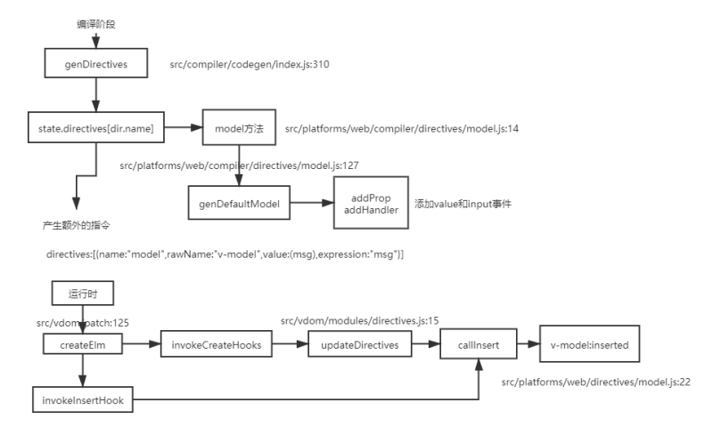

组件上的v-model指令：

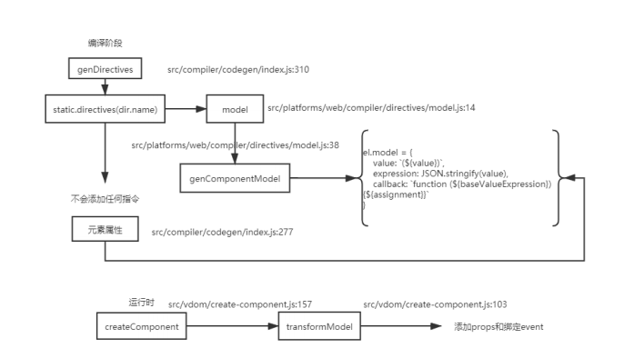

## 26.Vue中slot是如何实现的？什么时候使用它？
- 普通插槽，渲染在父级(父组件渲染完成后，替换子组件的内容，是虚拟节点替换)
- 作用域插槽在组件内部渲染！(子组件中渲染父组件的代码，是一个函数)

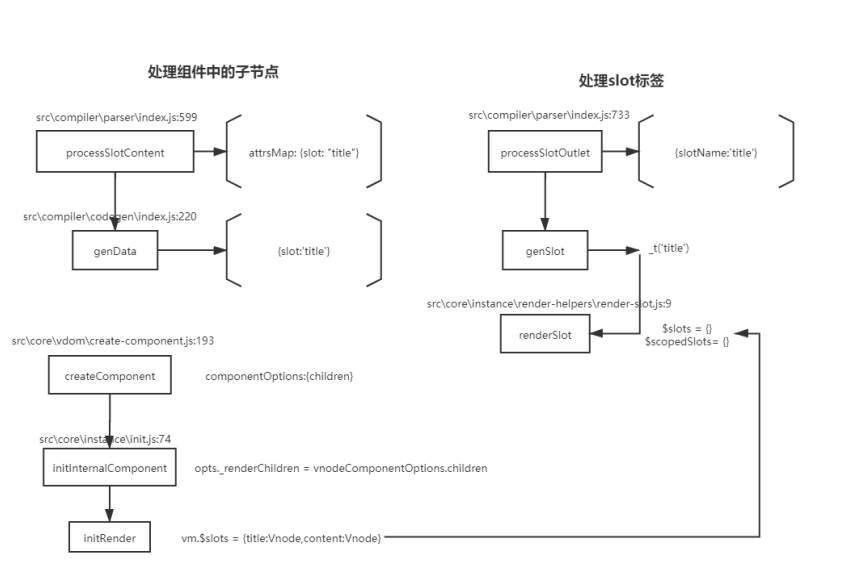


## 27.Vue.use是干什么的？原理是什么？
- Vue.use 是用来使用插件的，我们可以在插件中扩展全局组件、指令、原型方法等。
- 会调用插件的 install 方法，将Vue的构造函数默认传入，这样在插件中可以使用
Vue 无需依赖 Vue 库

`src/core/global-api/use.js`

## 28.组件中写name选项有哪些好处及作用？
- 增加name选项会在 components 属性中增加组件本身，实现组件的递归调用。
- 可以标识组件的具体名称方便调试和查找对应组件。

`src/core/global-api/extend.js:67`

## 29.Vue事件修饰符有哪些？其实现原理是什么？
.stop、.prevent、.capture！、.self、.once~、.passive&

`src\compiler\helpers.js:69`

`src\compiler\codegen\events.js:42`

`vue-dev\src\platforms\web\runtime\modules\events.js:105`

## 30.Vue中.sync修饰符的作用，用法及实现原理
`src\compiler\parser\index.js:798`

## 31.如何理解自定义指令
1. 在生成 ast 语法树时，遇到指令会给当前元素添加directives属性
2. 通过 genDeirectives 生成指令代码
3. 在 patch 前将指令的钩子提取到 cbs 中，在 patch 过程中调用对应的钩子
4. 当执行 cbs 对应的钩子时，调用对应指令定义的方法
- 指令本质上是装饰器，是vue对HTML元素的扩展，给HTML元素增加自定义功能，语义化HTML标签。vue编译DOM时，会执行与指令关联的JS代码，即找到指令对象，执行指令对象的相关方法。
- 自定义指令有五个生命周期（也叫钩子函数），分别是bind、inserted、update、componentUpdated、unbind

`src/vdom/patch.js:77 提取钩子函数`
`src/vdom/modules/directives.js：7 指令钩子`

## 32.keep-alive平时在哪里使用？原理是？
- 使用keep-alive包裹动态组件时, 会对组件进行缓存。避免组件的重新创建
- 缓存的组件不再进行初始化流程，执行activated deactivated 拉取最新的数据
- keep-alive -> 插槽 -> 重新渲染
```html
<keep-alive :include="whiteList" :exclude="blackList"
:max="count">
     <component :is="component"></component>
</keep-alive>
```
```html
<keep-alive :include="whiteList" :exclude="blackList"
:max="count">
    <router-view></router-view>
</keep-alive>
```
- keep-alive 第一次渲染的时候，会将其第一个子组件，缓存起来。
- 当组件后续在次被激活时，会复用上一次缓存的实例进行渲染。

`src\core\vdom\patch.js:210`

`src\core\vdom\create-component.js:36`

## 33.Vue-Router有几种钩子函数，具体是什么及执行流程是怎样的?
钩子函数的种类有：全局守卫、路由守卫、组件守卫
1. 导航被触发。
2. 在失活的组件里调用 `beforeRouteLeave` 守卫。
3. 调用全局的 `beforeEach` 守卫。
4. 在重用的组件里调用 `beforeRouteUpdate` 守卫 (2.2+)。
5. 在路由配置里调用 `beforeEnter` 。
6. 解析异步路由组件。
7. 在被激活的组件里调用 `beforeRouteEnter` 。
8. 调用全局的 `beforeResolve` 守卫 (2.5+)。
9. 导航被确认。
10. 调用全局的 `afterEach` 钩子。
11. 触发 DOM 更新。
12. 调用 `beforeRouteEnter` 守卫中传给 next 的回调函数，创建好的组件实例会作为回调函数的参数传入。

## 34.Vue-Router的两种模式的区别
- Vue-Router 有三种模式 hash 、 history 、 abstract
- abstract 模式是在不支持浏览器 API 环境使用，不依赖于浏览器历史
- hash 模式： hash + popState/hashChange 兼容性好但是不够美观， hash 服务端无法获取。不利于 seo 优化 (触发hasChange这个事件,通过监听hash值的变化来实现更新页面部分内容的操作)
- history 模式: historyApi (pushState()/replaceState()) + popState 美观，刷新会出现404 -> CLI webpack history-fallback
- 区别：hashchange，只会改变#后面的url片段。而pushState设置的新URL可以是与当前URL同源的任意URL。history模式则会将URL修改得就和正常请求后端的URL一样，如后端没有配置对应的路由处理，则会返回404错误

## 35.谈一下你对vuex的个人理解
- vuex 是专门为vue提供的全局状态管理系统，用于多个组件中数据共享、数据缓存
等。（无法持久化、内部核心原理是通过创造一个全局实例 new Vue ）
- 方法: replaceState 、 subscribe 、 registerModule 、 namespace(modules) 、
辅助函数...
- state：存储数据，存储状态；存放数据方式为响应式，vue组件从store中读取数据，如数据发生变化，组件也会对应的更新。
- getter：可以认为是 store 的计算属性，它的返回值根据它的依赖被缓存起来，只有当它的依赖值发生了改变才会被重新计算。
- mutation：更改 Vuex 的 store 中的状态的唯一方法是提交 mutation。
- action：包含任意异步操作，通过提交 mutation 间接更变状态。
- module：将 store 分割成模块，每个模块都具有state、mutation、action、getter、甚至是嵌套子模块。

## 36.Vue中的性能优化有哪些？
- 数据层级不易过深，合理设置响应式数据
- 不要将所有的数据都放在data中，data中的数据都会增加getter和setter，会收集对应的 watcher，这样就会降低性能
- 使用数据时缓存值的结果，不频繁取值
- vue 在 v-for 时给每项元素绑定事件需要用事件代理，节约性能
- 合理设置Key属性
- v-show和v-if的选取
- 控制组件粒度 -> Vue采用组件级更新
- 采用函数式组件 -> 函数式组件开销低
- 采用异步组件 -> 借助 webpack 分包的能力
- 使用 keep-alive 缓存组件
- 虚拟滚动、时间分片等策略...
- 合理使用路由懒加载、异步组件
- 数据持久化的问题，使用防抖、节流进行优化，尽可能的少执行和不执行
- 打包优化 (webpack)

## 37.Vue中使用了哪些设计模式?
- 单例模式 - 单例模式就是整个程序有且仅有一个实例
- 工厂模式 - 传入参数即可创建实例 `createElement `
- 发布订阅模式 - 订阅者把自己想订阅的事件注册到调度中心，当该事件触发时候，发布者发布该事件到调度中心，由调度中心统一调度订阅者注册到调度中心的处理代
码。`EventBus`
- 观察者模式 - `watcher & dep 的关系`
- 代理模式 - 代理模式给某一个对象提供一个代理对象,并由代理对象控制对原对象的引用。  
`_data属性、proxy、防抖、节流 let p = new Proxy`
- 装饰模式 - `Vue2 装饰器的用法 `（对功能进行增强 @）
- 中介者模式 - 中介者是一个行为设计模式,通过提供一个统一的接口让系统的不同部分进行通信。` Vuex`
- 策略模式 - 策略模式指对象有某个行为,但是在不同的场景中,该行为有不同的实现方案。 `mergeOptions`
- 外观模式 - 提供了统一的接口，用来访问子系统中的一群接口。

