## 一、WebGL-介绍

> WebGL（全写 Web Graphics Library）是一种 3D 绘图协议，这种绘图技术标准允许把 JavaScript 和 OpenGL ES 2.0 结合在一起，通过增加 OpenGL ES 2.0 的一个 JavaScript 绑定，WebGL 可以为 HTML5 Canvas 提供硬件 3D 加速渲染，这样 Web 开发人员就可以借助系统显卡来在浏览器里更流畅地展示 3D 场景和模型了，还能创建复杂的导航和数据视觉化。显然，WebGL 技术标准免去了开发网页专用渲染插件的麻烦，可被用于创建具有复杂 3D 结构的网站页面，甚至可以用来设计 3D 网页游戏等等


## 二、webgl 基础知识

### 1.刷底色

```js
// 在js中获取canvas画布
const canvas = document.querySelector("#canvas");
canvas.width = window.innerWidth;
canvas.height = window.innerHeight;
// 使用canvas 获取webgl 绘图上下文
const gl = canvas.getContext("webgl");
// 指定将要用来清空绘图区的颜色 rgba
gl.clearColor(1, 1, 0, 1);
// 刷底色
gl.clear(gl.COLOR_BUFFER_BIT);
```

**注：clearColor(r,g,b,a) 中的参数是红、绿、蓝、透明度，其定义域是[0,1]**

### 2.webgl 坐标系

> canvas 2d 画布的坐标系  
> canvas 2d 坐标系的原点在左上角  
> canvas 2d 坐标系的 y 轴方向是朝下的  
> canvas 2d 坐标系的坐标基底有两个分量，分别是一个像素的宽和一个像素的高，即 1 个单位的宽便是 1 个像素的宽，1 个单位的高便是一个像素的高


> webgl 的坐标系  
> webgl 坐标系的坐标原点在画布中心  
> webgl 坐标系的 y 轴方向是朝上的  
> webgl 坐标基底中的两个分量分别是半个 canvas 的宽和 canvas 的高，即 1 个单位的宽便是半个个 canvas 的宽，1 个单位的高便是半个 canvas 的高

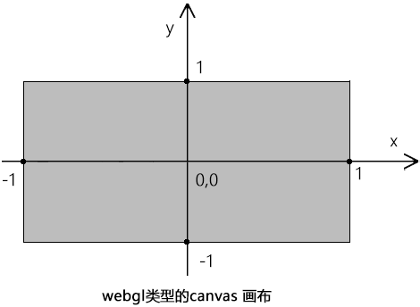

### 3.webgl 画一个点

#### 1) 绘图的基本步骤

1. 找一张画布

2. 找一支画笔

3. 开始画画

**canvas 2d 的绘图逻辑就是如此**

```js
//canvas画布
const canvas = document.getElementById("canvas");
//二维画笔
const ctx = canvas.getContext("2d");
//设置画笔的颜色
ctx.fillStyle = "red";
//用画笔画一个矩形
ctx.fillRect(20, 20, 300, 200);
```

#### 2) canvas 2d 和 webgl 绘图的差异

> 浏览器有三大线程： js 引擎线程、GUI 渲染线程、浏览器事件触发线程  
> GUI 渲染线程就是用于渲图，，在这个渲染线程里，有负责不同渲染工作的工人。比如有负责渲染 HTML+css 的工人，有负责渲染二维图形的工人，有负责渲染三维图形的工人  
> 渲染二维图形的工人说的是 js 语言  
> 渲染三维图形的工人说的是 GLSL ES 语言  
> GLSL ES <=> 程序对象 <=> js

#### 3) webgl 的绘图思路步骤

1. 找一台电脑 - 浏览器里内置的 webgl 渲染引擎，负责渲染 webgl 图形，只认 GLSL ES 语言
2. 找一块手绘板 - 程序对象，承载 GLSL ES 语言，翻译 GLSL ES 语言和 js 语言，使两者可以相互通信
3. 找一支触控笔 - 通过 canvas 获取的 webgl 类型的上下文对象，可以向手绘板传递绘图命令，并接收手绘板的状态信息
4. 开始画画 - 通过 webgl 类型的上下文对象，用 js 画画

```html
<canvas id="canvas"></canvas>
<!-- 顶点着色器 -->
<script id="vertexShader" type="x-shader/x-vertex">
  void main(){
    //点位
    gl_Position=vec4(1,1,1,2);
    //尺寸
    gl_PointSize=50.0;
  }
</script>
<!-- 片元着色器 -->
<script id="fragmentShader" type="x-shader/x-fragment">
  void main(){
    // 片元的颜色
    gl_FragColor=vec4(1,1,0,1);
  }
</script>
<script type="module">
  // canvas 画布
  const canvas = document.querySelector("#canvas");
  canvas.width = window.innerWidth;
  canvas.height = window.innerHeight;

  // 获取着色器文本
  const vsSource = document.querySelector("#vertexShader").innerText;
  const fsSource = document.querySelector("#fragmentShader").innerText;

  //三维画笔
  const gl = canvas.getContext("webgl");

  //初始化着色器
  //功能：解析着色器文本，整合到程序对象里，关联webgl上下文对象，实现两种语言的相互通信
  initShaders(gl, vsSource, fsSource);

  //声明颜色 rgba
  gl.clearColor(0, 0, 0, 1);
  //刷底色
  gl.clear(gl.COLOR_BUFFER_BIT);
  //绘制顶点
  gl.drawArrays(gl.POINTS, 0, 1);

  function initShaders(gl, vsSource, fsSource) {
    //创建程序对象
    const program = gl.createProgram();
    //建立着色对象
    const vertexShader = loadShader(gl, gl.VERTEX_SHADER, vsSource);
    const fragmentShader = loadShader(gl, gl.FRAGMENT_SHADER, fsSource);
    //把顶点着色对象装进程序对象中
    gl.attachShader(program, vertexShader);
    //把片元着色对象装进程序对象中
    gl.attachShader(program, fragmentShader);
    //连接webgl上下文对象和程序对象
    gl.linkProgram(program);
    //启动程序对象
    gl.useProgram(program);
    //将程序对象挂到上下文对象上
    gl.program = program;
    return true;
  }

  function loadShader(gl, type, source) {
    //根据着色类型，建立着色器对象
    const shader = gl.createShader(type);
    //将着色器源文件传入着色器对象中
    gl.shaderSource(shader, source);
    //编译着色器对象
    gl.compileShader(shader);
    //返回着色器对象
    return shader;
  }
</script>
```

#### 4) webgl 着色器

webgl 绘图需要两种着色器：

- 顶点着色器（Vertex shader）：描述顶点的特征，如位置、颜色等
- 片元着色器（Fragment shader）：进行逐片元处理，如光照
  > 两点决定一条直线，顶点着色器里的顶点就是决定这一条直线的两个点，片元着色器里的片元就是把直线画到画布上后，这两个点之间构成直线的每个像素

## 三、js 与着色器间的数据传输

### 1. js 控制顶点位置

> attribute 变量是只有顶点着色器才能使用它的  
> js 可以通过 attribute 变量向顶点着色器传递与顶点相关的数据

```html
<canvas id="canvas"></canvas>
<!-- 顶点着色器 -->
<script id="vertexShader" type="x-shader/x-vertex">
  attribute vec4 a_Position;
  void main(){
      //点位
      gl_Position = a_Position;
      //尺寸
      gl_PointSize = 50.0;
  }
</script>
<!-- 片元着色器 -->
<script id="fragmentShader" type="x-shader/x-fragment">
  void main(){
      //片元的颜色
      gl_FragColor = vec4(1,1,0,1);
  }
</script>
<script type="module">
  import { initShaders } from "../jsm/Utils.js";

  const canvas = document.querySelector("#canvas");
  canvas.width = window.innerWidth;
  canvas.height = window.innerHeight;

  // 获取着色器文本
  const vsSource = document.querySelector("#vertexShader").innerText;
  const fsSource = document.querySelector("#fragmentShader").innerText;

  //三维画笔
  const gl = canvas.getContext("webgl");

  //初始化着色器
  initShaders(gl, vsSource, fsSource);

  //声明颜色 rgba
  gl.clearColor(0, 0, 0, 1);
  //刷底色
  gl.clear(gl.COLOR_BUFFER_BIT);

  /*
   * 获取attribute 变量
   * gl.getAttribLocation() 是获取着色器中attribute 变量的方法
   * gl.program 是初始化着色器时，在上下文对象上挂载的程序对象
   * 'a_Position' 是着色器暴露出的变量名
   */
  const a_Position = gl.getAttribLocation(gl.program, "a_Position");

  //修改attribute 变量
  gl.vertexAttrib3f(a_Position, 0, 0.5, 0);
  // gl.vertexAttrib2f(a_Position, 0.5, 0.5);
  // gl.vertexAttrib1f(a_Position, 0.1);

  //绘制顶点
  gl.drawArrays(gl.POINTS, 0, 1);
</script>
```

### 2. 鼠标控制点位

1. canvas 坐标系转 webgl 坐标系

```js
canvas.addEventListener("click", function(event) {
  const { clientX, clientY } = event;
  const { left, top, width, height } = canvas.getBoundingClientRect();
  const [cssX, cssY] = [clientX - left, clientY - top];
  //解决坐标原点位置的差异
  const [halfWidth, halfHeight] = [width / 2, height / 2];
  const [xBaseCenter, yBaseCenter] = [cssX - halfWidth, cssY - halfHeight];
  // 解决y 方向的差异
  const yBaseCenterTop = -yBaseCenter;
  //解决坐标基底的差异
  const [x, y] = [xBaseCenter / halfWidth, yBaseCenterTop / halfHeight];
});
```

2. 修改 attribute 变量
   1. 获取 attribute 变量
   2. 在获取鼠标在 webgl 画布中的位置的时候，修改 attribute 变量
   3. 清理画布
   4. 绘图

```js
gl.vertexAttrib2f(a_Position, x, y);
gl.clear(gl.COLOR_BUFFER_BIT);
gl.drawArrays(gl.POINTS, 0, 1);
```

3. webgl 的同步绘图原理
   > gl.drawArrays(gl.POINTS, 0, 1) 方法和 canvas 2d 里的 ctx.draw() 方法是不一样的，ctx.draw() 真的像画画一样，一层一层的覆盖图像  
   > gl.drawArrays() 方法只会同步绘图，走完了 js 主线程后，再次绘图时，就会从头再来。也就说，异步执行的 drawArrays() 方法会把画布上的图像都刷掉：  
   > 原理 => webgl 绘图的时候，是先在颜色缓冲区中画出来，颜色缓冲区中存储的图像，只在当前线程有效。比如我们先在 js 主线程中绘图，主线程结束后，会再去执行信息队列里的异步线程。在执行异步线程时，颜色缓冲区就会被 webgl 系统重置

**鼠标绘制多个点**

```js
const a_Position = gl.getAttribLocation(gl.program, "a_Position");
gl.clearColor(0.0, 0.0, 0.0, 1.0);
gl.clear(gl.COLOR_BUFFER_BIT);

const g_points = [];
canvas.addEventListener("click", function(event) {
  const { clientX, clientY } = event;
  const { left, top, width, height } = canvas.getBoundingClientRect();
  const [cssX, cssY] = [clientX - left, clientY - top];
  const [halfWidth, halfHeight] = [width / 2, height / 2];
  const [xBaseCenter, yBaseCenter] = [cssX - halfWidth, cssY - halfHeight];
  const yBaseCenterTop = -yBaseCenter;
  const [x, y] = [xBaseCenter / halfWidth, yBaseCenterTop / halfHeight];

  g_points.push({ x, y });
  gl.clear(gl.COLOR_BUFFER_BIT);
  g_points.forEach(({ x, y }) => {
    gl.vertexAttrib2f(a_Position, x, y);
    gl.drawArrays(gl.POINTS, 0, 1);
  });
});
```

### 3. js 控制顶点尺寸

```html
<canvas id="canvas"></canvas>
<!-- 顶点着色器 -->
<script id="vertexShader" type="x-shader/x-vertex">
  attribute vec4 a_Position;
  attribute float a_PointSize;
  void main(){
      //点位
      gl_Position=a_Position;
      //尺寸
      gl_PointSize=a_PointSize;
  }
</script>
<!-- 片元着色器 -->
<script id="fragmentShader" type="x-shader/x-fragment">
  void main(){
      gl_FragColor=vec4(1,1,0,1);
  }
</script>
<script type="module">
  import { initShaders } from "../jsm/Utils.js";

  const canvas = document.querySelector("#canvas");
  canvas.width = window.innerWidth;
  canvas.height = window.innerHeight;

  // 获取着色器文本
  const vsSource = document.querySelector("#vertexShader").innerText;
  const fsSource = document.querySelector("#fragmentShader").innerText;

  //三维画笔
  const gl = canvas.getContext("webgl");

  //初始化着色器
  initShaders(gl, vsSource, fsSource);

  //获取attribute 变量
  const a_Position = gl.getAttribLocation(gl.program, "a_Position");
  const a_PointSize = gl.getAttribLocation(gl.program, "a_PointSize");

  //修改attribute 变量
  gl.vertexAttrib1f(a_Position, 0.1);
  gl.vertexAttrib1f(a_PointSize, 50);

  //声明颜色 rgba
  gl.clearColor(0, 0, 0, 1);

  //刷底色
  gl.clear(gl.COLOR_BUFFER_BIT);

  //绘制顶点
  gl.drawArrays(gl.POINTS, 0, 1);
</script>
```

**鼠标随机改变顶点大小**

```html
<canvas id="canvas"></canvas>
<!-- 顶点着色器 -->
<script id="vertexShader" type="x-shader/x-vertex">
  attribute vec4 a_Position;
  attribute float a_PointSize;
  void main(){
      //点位
      gl_Position=a_Position;
      //尺寸
      gl_PointSize=a_PointSize;
  }
</script>
<!-- 片元着色器 -->
<script id="fragmentShader" type="x-shader/x-fragment">
  void main(){
      gl_FragColor=vec4(1,1,0,1);
  }
</script>
<script type="module">
  import { initShaders } from "../jsm/Utils.js";

  const canvas = document.querySelector("#canvas");
  canvas.width = window.innerWidth;
  canvas.height = window.innerHeight;

  // 获取着色器文本
  const vsSource = document.querySelector("#vertexShader").innerText;
  const fsSource = document.querySelector("#fragmentShader").innerText;

  //三维画笔
  const gl = canvas.getContext("webgl");

  //初始化着色器
  initShaders(gl, vsSource, fsSource);

  // 获取attribute 变量
  const a_Position = gl.getAttribLocation(gl.program, "a_Position");
  const a_PointSize = gl.getAttribLocation(gl.program, "a_PointSize");

  // 顶点
  const a_points = [{ x: 0, y: 0, size: 10 }];

  //声明颜色 rgba
  gl.clearColor(0, 0, 0, 1);

  //刷底色
  gl.clear(gl.COLOR_BUFFER_BIT);

  render();

  // 鼠标点击事件
  canvas.addEventListener("click", ({ clientX, clientY }) => {
    console.log(clientX, clientY);
    const { left, top, width, height } = canvas.getBoundingClientRect();
    const [cssX, cssY] = [clientX - left, clientY - top];
    //解决坐标原点位置的差异
    const [halfWidth, halfHeight] = [width / 2, height / 2];
    const [xBaseCenter, yBaseCenter] = [cssX - halfWidth, cssY - halfHeight];
    // 解决y 方向的差异
    const yBaseCenterTop = -yBaseCenter;
    //解决坐标基底的差异
    const [x, y] = [xBaseCenter / halfWidth, yBaseCenterTop / halfHeight];

    const size = Math.random() * 50 + 10;
    a_points.push({ x, y, size });
    render();
  });

  // 渲染方法
  function render() {
    gl.clear(gl.COLOR_BUFFER_BIT);
    a_points.forEach(({ x, y, size }) => {
      gl.vertexAttrib2f(a_Position, x, y);
      gl.vertexAttrib1f(a_PointSize, size);
      gl.drawArrays(gl.POINTS, 0, 1);
    });
  }
</script>
```

### 4. js 控制顶点的颜色

**限定颜色变量的限定符叫 uniform**

```html
<canvas id="canvas"></canvas>
<!-- 顶点着色器 -->
<script id="vertexShader" type="x-shader/x-vertex">
  attribute vec4 a_Position;
  void main(){
      //点位
      gl_Position=a_Position;
      //尺寸
      gl_PointSize=50.0;
  }
</script>
<!-- 片元着色器 -->
<script id="fragmentShader" type="x-shader/x-fragment">
  precision mediump float;
  uniform vec4 u_FragColor;
  void main(){
      gl_FragColor=u_FragColor;
  }
</script>
<script type="module">
  import { initShaders } from "../jsm/Utils.js";

  const canvas = document.querySelector("#canvas");
  canvas.width = window.innerWidth;
  canvas.height = window.innerHeight;

  // 获取着色器文本
  const vsSource = document.querySelector("#vertexShader").innerText;
  const fsSource = document.querySelector("#fragmentShader").innerText;

  //三维画笔
  const gl = canvas.getContext("webgl");

  //初始化着色器
  initShaders(gl, vsSource, fsSource);

  //声明颜色 rgba
  gl.clearColor(0, 0, 0, 1);
  //刷底色
  gl.clear(gl.COLOR_BUFFER_BIT);

  //获取attribute 变量
  const a_Position = gl.getAttribLocation(gl.program, "a_Position");

  //获取uniform 变量
  const u_FragColor = gl.getUniformLocation(gl.program, "u_FragColor");

  //修改attribute 变量
  gl.vertexAttrib1f(a_Position, 0.1);

  //修改uniform 变量
  gl.uniform4f(u_FragColor, 1, 0, 1, 1);

  //绘制顶点
  gl.drawArrays(gl.POINTS, 0, 1);
</script>
```

**鼠标随机改变顶点颜色**

```html
<canvas id="canvas"></canvas>
<!-- 顶点着色器 -->
<script id="vertexShader" type="x-shader/x-vertex">
  attribute vec4 a_Position;
  attribute float a_PointSize;
  void main(){
      //点位
      gl_Position=a_Position;
      //尺寸
      gl_PointSize=a_PointSize;
  }
</script>
<!-- 片元着色器 -->
<script id="fragmentShader" type="x-shader/x-fragment">
  precision mediump float;
  uniform vec4 u_FragColor;
  void main(){
      gl_FragColor=u_FragColor;
  }
</script>
<script type="module">
  import { initShaders } from "../jsm/Utils.js";

  const canvas = document.querySelector("#canvas");
  canvas.width = window.innerWidth;
  canvas.height = window.innerHeight;

  // 获取着色器文本
  const vsSource = document.querySelector("#vertexShader").innerText;
  const fsSource = document.querySelector("#fragmentShader").innerText;

  //三维画笔
  const gl = canvas.getContext("webgl");

  //初始化着色器
  initShaders(gl, vsSource, fsSource);

  //获取attribute 和 uniform 变量
  const a_Position = gl.getAttribLocation(gl.program, "a_Position");
  const a_PointSize = gl.getAttribLocation(gl.program, "a_PointSize");
  const u_FragColor = gl.getUniformLocation(gl.program, "u_FragColor");

  const a_points = [
    { x: 0, y: 0, size: 10, color: { r: 1, g: 0, b: 0, a: 1 } },
  ];

  //声明颜色 rgba
  gl.clearColor(0, 0, 0, 1);

  //刷底色
  gl.clear(gl.COLOR_BUFFER_BIT);

  render();

  // 鼠标点击事件
  canvas.addEventListener("click", ({ clientX, clientY }) => {
    console.log(clientX, clientY);
    const { left, top, width, height } = canvas.getBoundingClientRect();
    const [cssX, cssY] = [clientX - left, clientY - top];
    //解决坐标原点位置的差异
    const [halfWidth, halfHeight] = [width / 2, height / 2];
    const [xBaseCenter, yBaseCenter] = [cssX - halfWidth, cssY - halfHeight];
    // 解决y 方向的差异
    const yBaseCenterTop = -yBaseCenter;
    //解决坐标基底的差异
    const [x, y] = [xBaseCenter / halfWidth, yBaseCenterTop / halfHeight];

    const size = Math.random() * 50 + 10;
    const n = Math.random();
    const color = { r: n, g: n, b: 1, a: 1 };
    a_points.push({ x, y, size, color });
    render();
  });

  // 渲染方法
  function render() {
    gl.clear(gl.COLOR_BUFFER_BIT);
    a_points.forEach(({ x, y, size, color: { r, g, b, a } }) => {
      gl.vertexAttrib2f(a_Position, x, y);
      gl.vertexAttrib1f(a_PointSize, size);
      // gl.uniform4f(u_FragColor, r, g, b, a);
      const arr = new Float32Array([r, g, b, a]);
      // Float32Array 是一种32 位的浮点型数组，它在浏览器中的运行效率要比普通的Array 高很多
      gl.uniform4fv(u_FragColor, arr);
      gl.drawArrays(gl.POINTS, 0, 1);
    });
  }
</script>
```

## 四、绘制图形

**三角形是一个最简单、最稳定的面，webgl 中的三维模型都是由三角面组成的**

### 1.webgl 的绘图方式

- 绘制多点  
  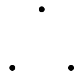

- 如果是线，就连点成线  
  

- 如果是面，那就在图形内部，逐片元填色  
  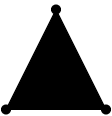

### 2. 绘制多点

> 在 js 中建立顶点数据，着色器肯定是拿不到的，这是语言不通导致的，为了解决这个问题，webgl 系统就建立了一个能翻译双方语言的缓冲区  
> js 可以用特定的方法把数据存在这个缓冲区中，着色器可以从缓冲区中拿到相应的数据

1. 建立顶点数据，两个浮点数构成一个顶点，分别代表 x、y 值

```js
const vertices = new Float32Array([
  //x    y
  0.0,
  0.1, //顶点
  -0.1,
  -0.1, //顶点
  0.1,
  -0.1, //顶点
]);
// 这些顶点数据是存储在js 缓存里的，着色器拿不到，所以需要建立一个着色器和js 都能进入的公共区
```

2. 建立缓冲对象

```js
const vertexBuffer = gl.createBuffer();
// 上面的这个缓冲区是独立存在的，它只是一个空着的仓库，和谁都没有关系。接下就让其和着色器建立连接
```

3. 绑定缓冲对象

```js
gl.bindBuffer(gl.ARRAY_BUFFER, vertexBuffer);

// gl.bindBuffer(target,buffer)   绑定缓冲区
// - target  要把缓冲区放在webgl 系统中的什么位置
// - buffer 缓冲区

// 着色器对象在执行initShaders() 初始化方法的时候，已经被写入webgl 上下文对象gl 中了。
// 当缓冲区和着色器建立了绑定关系，我们就可以往这块空间写入数据了
```

4. 往缓冲区对象中写入数据

```js
gl.bufferData(gl.ARRAY_BUFFER, vertices, gl.STATIC_DRAW);

// bufferData(target, data, usage) 将数据写入缓冲区
// - target 要把缓冲区放在webgl 系统中的什么位置
// - data  数据
// - usage 向缓冲区写入数据的方式，咱们在这里先知道 gl.STATIC_DRAW 方式即可，
//它是向缓冲区中一次性写入数据，着色器会绘制多次。

// 现在着色器虽然绑定了缓冲区，可以访问里面的数据了，但是我们还得让着色器知道这个仓库是给哪个变量的，
//比如咱们这里用于控制点位的attribute 变量。这样做是为了提高绘图效率。
```

5. 将缓冲区对象分配给 attribute 变量

```js
const a_Position = gl.getAttribLocation(gl.program, "a_Position");
gl.vertexAttribPointer(a_Position, 2, gl.FLOAT, false, 0, 0);

// gl.vertexAttribPointer(local,size,type,normalized,stride,offset)   将缓冲区对象分配给attribute 变量

// - local  attribute变量
// - size 顶点分量的个数，比如我们的vertices 数组中，两个数据表示一个顶点，那咱们就写2
// - type 数据类型，比如 gl.FLOAT 浮点型
// - normalized 是否将顶点数据归一
// - stride 相邻两个顶点间的字节数，我的例子里写的是0，那就是顶点之间是紧挨着的
// - offset 从缓冲区的什么位置开始存储变量，我的例子里写的是0，那就是从头开始存储变量

// 到了这里，着色就知道缓冲区的数据是给谁的了。因为缓冲区里的顶点数据是数组，里面有多个顶点。
//所以得开启一个让着色器批量处理顶点数据的属性。默认着色器只会一个一个的接收顶点数据，然后一个一个的绘制顶点。
```

6. 开启顶点数据的批处理功能

```js
gl.enableVertexAttribArray(a_Position);

// - location attribute变量
```

7. 绘图

```js
gl.clearColor(0.0, 0.0, 0.0, 1.0);
gl.clear(gl.COLOR_BUFFER_BIT);
gl.drawArrays(gl.POINTS, 0, 3);

// drawArrays(mode,first,count)

// - mode 绘图模式，比如 gl.POINTS 画点
// - first 从哪个顶点开始绘制
// - count 要画多少个顶点
```

**整体代码**

```html
<canvas id="canvas"></canvas>
<!-- 顶点着色器 -->
<script id="vertexShader" type="x-shader/x-vertex">
  attribute vec4 a_Position;
  void main(){
      //点位
      gl_Position=a_Position;
      //尺寸
      gl_PointSize=50.0;
  }
</script>
<!-- 片元着色器 -->
<script id="fragmentShader" type="x-shader/x-fragment">
  void main(){
      gl_FragColor=vec4(1,1,0,1);
  }
</script>
<script type="module">
  import { initShaders } from "../jsm/Utils.js";

  const canvas = document.querySelector("#canvas");
  canvas.width = window.innerWidth;
  canvas.height = window.innerHeight;

  // 获取着色器文本
  const vsSource = document.querySelector("#vertexShader").innerText;
  const fsSource = document.querySelector("#fragmentShader").innerText;

  //三维画笔
  const gl = canvas.getContext("webgl");

  //初始化着色器
  initShaders(gl, vsSource, fsSource);

  //如何向attribute 变量中写入多点，并绘制多点
  //顶点数据
  const vertices = new Float32Array([0, 0.2, -0.2, -0.1, 0.2, -0.1, 0.4, 0.2]);
  //缓冲对象
  const vertexBuffer = gl.createBuffer();
  //绑定缓冲对象
  gl.bindBuffer(gl.ARRAY_BUFFER, vertexBuffer);
  //写入数据
  gl.bufferData(gl.ARRAY_BUFFER, vertices, gl.STATIC_DRAW);
  //获取attribute 变量
  const a_Position = gl.getAttribLocation(gl.program, "a_Position");
  //修改attribute 变量
  gl.vertexAttribPointer(a_Position, 2, gl.FLOAT, false, 0, 0);
  //赋能-批处理
  gl.enableVertexAttribArray(a_Position);

  //声明颜色 rgba
  gl.clearColor(0, 0, 0, 1);

  //刷底色
  gl.clear(gl.COLOR_BUFFER_BIT);

  //绘制顶点
  gl.drawArrays(gl.POINTS, 0, 4);
</script>
```

### 3. 绘制图形

1. 绘制三角面

- 顶点着色器中的 gl_PointSize = 20.0 不要，因为这个属性是控制顶点大小的，咱们已经不需要显示顶点了。

```js
<script id="vertexShader" type="x-shader/x-vertex">
    attribute vec4 a_Position;
    void main(){
        gl_Position = a_Position;
        //gl_PointSize = 20.0;
    }
</script>
```

- 在 js 中修改绘图方式

```js
// gl.drawArrays(gl.POINTS, 0, 3);
gl.drawArrays(gl.TRIANGLES, 0, 3);
```

**gl.TRIANGLES 就是绘制三角面**

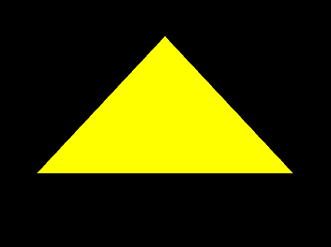

2. 基本图形

gl.drawArrays(mode,first,count) 方法可以绘制一下图形：

- POINTS 可视的点
- LINES 单独线段
- LINE_STRIP 线条
- LINE_LOOP 闭合线条
- TRIANGLES 单独三角形
- TRIANGLE_STRIP 三角带
- TRIANGLE_FAN 三角扇

  **2.1 点的绘制**  
   POINTS 可视的点

  

  上面六个点的绘制顺序是：v0, v1, v2, v3, v4, v5

  **2.2 线的绘制**

  1. LINES 单独线段

  

  上面三条有向线段的绘制顺序是：  
  ​ v0>v1  
  ​ v2>v3  
  ​ v4>v5

  2. LINE_STRIP 线条

  

  上面线条的绘制顺序是：v0>v1>v2>v3>v4>v5

  3. LINE_LOOP 闭合线条

  

  上面线条的绘制顺序是：v0>v1>v2>v3>v4>v5>v0

  **2.3 面的绘制**

  对于面的绘制，我们首先要知道一个原理：

  - 面有正反两面。
  - 面向我们的面，如果是正面，那它必然是逆时针绘制的；
  - 面向我们的面，如果是反面，那它必然是顺时针绘制的；

  接下来，看下面的三种绘制方式：

  1. TRIANGLES 单独三角形

  

  上面两个面的绘制顺序是：​  
  ​ v0>v1>v2  
  ​ v3>v4>v5

  2. TRIANGLE_STRIP 三角带

  

  上面四个面的绘制顺序是：  
  v0>v1>v2  
  以上一个三角形的第二条边+下一个点为基础，以和第二条边相反的方向绘制三角形  
  v2>v1>v3  
  以上一个三角形的第三条边+下一个点为基础，以和第三条边相反的方向绘制三角形  
  v2>v3>v4  
  以上一个三角形的第二条边+下一个点为基础，以和第二条边相反的方向绘制三角形  
  v4>v3>v5

  规律：  
  第一个三角形：v0>v1>v2  
  第偶数个三角形：以上一个三角形的第二条边+下一个点为基础，以和第二条边相反的方向绘制三角形  
  第奇数个三角形：以上一个三角形的第三条边+下一个点为基础，以和第三条边相反的方向绘制三角形

  3. TRIANGLE_FAN 三角扇

  

  上面四个面的绘制顺序是：  
  ​ v0>v1>v2  
  以上一个三角形的第三条边+下一个点为基础，按照和第三条边相反的顺序，绘制三角形  
  ​ v0>v2>v3  
  以上一个三角形的第三条边+下一个点为基础，按照和第三条边相反的顺序，绘制三角形  
  ​ v0>v3>v4  
  以上一个三角形的第三条边+下一个点为基础，按照和第三条边相反的顺序，绘制三角形  
  ​ v0>v4>v5

### 4. 绘制矩形

首先，webgl 可以绘制的面只有三角面，所以要绘制矩形面的话，只能用两个三角形去拼。

1. TRIANGLE_STRIP 三角带拼矩形


上面的两个三角形分别是：  
v0>v1>v2  
v2>v1>v3

```js
// 1.建立顶点数据(下面两个浮点代表一个顶点，依次是v0、v1、v2、v3，如上图所示)
const vertices = new Float32Array([-0.2, 0.2, -0.2, -0.2, 0.2, 0.2, 0.2, -0.2]);

// 2.绘图
gl.drawArrays(gl.TRIANGLE_STRIP, 0, 4);
```

效果如下：


### 5. 异步绘制多点

> 当缓冲区被绑定在了 webgl 上下文对象上后，我们在异步方法里直接对其进行修改即可，顶点着色器在绘图的时候会自动从其中调用数据。  
> WebGLBuffer 缓冲区中的数据在异步方法里不会被重新置空。

```html
<canvas id="canvas"></canvas>
<!-- 顶点着色器 -->
<script id="vertexShader" type="x-shader/x-vertex">
  attribute vec4 a_Position;
  void main(){
      gl_Position=a_Position;
      gl_PointSize=20.0;
  }
</script>
<!-- 片元着色器 -->
<script id="fragmentShader" type="x-shader/x-fragment">
  void main(){
      gl_FragColor=vec4(1,1,0,1);
  }
</script>
<script type="module">
  import { initShaders } from "../jsm/Utils.js";

  const canvas = document.querySelector("#canvas");
  canvas.width = window.innerWidth;
  canvas.height = window.innerHeight;

  // 获取着色器文本
  const vsSource = document.querySelector("#vertexShader").innerText;
  const fsSource = document.querySelector("#fragmentShader").innerText;

  //三维画笔
  const gl = canvas.getContext("webgl");

  //初始化着色器
  initShaders(gl, vsSource, fsSource);

  //顶点数据
  let vertices = [0, 0.2];
  //缓冲对象
  const vertexBuffer = gl.createBuffer();
  //绑定缓冲对象
  gl.bindBuffer(gl.ARRAY_BUFFER, vertexBuffer);
  //写入数据
  gl.bufferData(gl.ARRAY_BUFFER, new Float32Array(vertices), gl.STATIC_DRAW);
  //获取attribute 变量
  const a_Position = gl.getAttribLocation(gl.program, "a_Position");
  //修改attribute 变量
  gl.vertexAttribPointer(a_Position, 2, gl.FLOAT, false, 0, 0);
  //赋能-批处理
  gl.enableVertexAttribArray(a_Position);

  //声明颜色 rgba
  gl.clearColor(0, 0, 0, 1);
  //刷底色
  gl.clear(gl.COLOR_BUFFER_BIT);
  //绘制顶点
  gl.drawArrays(gl.POINTS, 0, 1);

  setTimeout(() => {
    vertices.push(-0.2, -0.1);
    gl.bufferData(gl.ARRAY_BUFFER, new Float32Array(vertices), gl.STATIC_DRAW);
    gl.clear(gl.COLOR_BUFFER_BIT);
    gl.drawArrays(gl.POINTS, 0, 2);
  }, 1000);

  setTimeout(() => {
    gl.clear(gl.COLOR_BUFFER_BIT);
    gl.drawArrays(gl.POINTS, 0, 2);
    gl.drawArrays(gl.LINE_STRIP, 0, 2);
  }, 2000);
</script>
```

### 6.图形转面

**“砍角”，其原理就是从起点将多边形中符合特定条件的角逐个砍掉，然后保存到一个集合里，直到把多边形砍得只剩下一个三角形为止。这时候集合里的所有三角形就是想要的独立三角形**

## 五、矩阵变换

变换有三种状态：平移、旋转、缩放。

当变换一个图形时，实际上就是在移动这个图形的所有顶点。

### 1.平移

对图形的平移就是对图形所有顶点的平移


在实际代码中，要有一个向量的概念，比如 (x,y,z) ，我们既可以说它是一个顶点位置，也可以说它是一个向量，顶点的位移其实就是向量的加法。

GLSL ES 语言里的向量运算

```js
attribute vec4 a_Position;
vec4 translation=vec4(0,0.2,0,0);
void main(){
    gl_Position = a_Position+translation;
}
```

- a_Position 是原始点位，属于 attribute 变量
- translation 是顶点着色器里的私有变量，没有向外部暴露，属于 4 维向量
- a_Position+translation 便是着色器内的向量加法，这里是对原始点位进行位移

### 2.旋转

物体的旋转方向是有正负之分的，在 webgl 中，除裁剪空间之外的大部分功能都使用了右手坐标系。

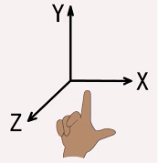

- 当物体绕 z 轴，从 x 轴正半轴向 y 轴正半轴逆时针旋转时，是正向旋转，反之为负。
- 当物体绕 x 轴，从 y 轴正半轴向 z 轴正半轴逆时针旋转时，是正向旋转，反之为负。
- 当物体绕 y 轴，从 z 轴正半轴向 x 轴正半轴逆时针旋转时，是正向旋转，反之为负。

旋转公式:

由一个让顶点围绕 z 轴旋转的例子引出


已知：

- 点 A 的位置是(ax,ay,az)
- 点 A 要围绕 z 轴旋转 β 度，转到点 B 的位置

求：点 A 旋转后的 bx、by 位置

因为 ∠β 是已知的，∠α 可以通过点 A 得出:

```js
∠xOB=α+β
```

三角函数就可以推出 bx、by

设 ∠xOB=θ，则：

```js
bx=cosθ*|OA|
by=sinθ*|OA|
```

|OA|是点 O 到点 A 的距离，可以直接用点 A 求出:

```js
|OA|=Math.sqrt(ax*ax+ay*ay)
```

只需要知道 cosθ 和 sinθ 的值即可，因为：θ=α+β  
所以可以利用和角公式求 cosθ 和 sinθ 的值：

```js
cosθ = cos(α + β);
cosθ = cosα * cosβ - sinα * sinβ;

sinθ = sin(α + β);
sinθ = cosβ * sinα + sinβ * cosα;
```

所以：

```js
bx=cosθ*|OA|
bx=(cosα*cosβ-sinα*sinβ)*|OA|
bx=cosα*cosβ*|OA|-sinα*sinβ*|OA|

by=sinθ*|OA|
by=(cosβ*sinα+sinβ*cosα)*|OA|
by=cosβ*sinα*|OA|+sinβ*cosα*|OA|
```

因为：

```js
cosα*|OA|=ax
sinα*|OA|=ay
```

简化得到 bx、by 的公式：

```js
bx = ax * cosβ - ay * sinβ;
by = ay * cosβ + ax * sinβ;
```

在着色器中旋转

```js
<script id="vertexShader" type="x-shader/x-vertex">
    attribute vec4 a_Position;
    float angle=radians(80.0);
    float sinB=sin(angle);
    float cosB=cos(angle);
    void main(){
        gl_Position.x=a_Position.x*cosB-a_Position.y*sinB;
        gl_Position.y=a_Position.y*cosB+a_Position.x*sinB;
        gl_Position.z=a_Position.z;
        gl_Position.w=1.0;
    }
</script>
```

- radians(float degree) 将角度转弧度
- sin(float angle) 正弦
- cos(float angle) 余弦

### 3.缩放

缩放可以理解为对向量长度的改变，或者对向量坐标分量的同步缩放

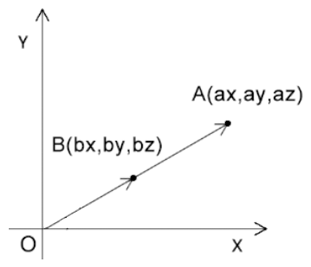

已知：

- 点 A 的位置是(ax,ay,az)
- 点 A 基于原点內缩了一半

求：点 A 內缩了一半后的 bx、by、bz 位置

解：

```js
bx = ax * 0.5;
by = ay * 0.5;
bz = az * 0.5;
```

在着色器中缩放

对 gl_Position 的 x、y、z 依次缩放：

```js
<script id="vertexShader" type="x-shader/x-vertex">
attribute vec4 a_Position;
float scale=1.2;
void main(){
	gl_Position.x= a_Position.x*scale;
	gl_Position.y= a_Position.y*scale;
	gl_Position.z= a_Position.z*scale;
	gl_Position.w=1.0;
}
</script>
```

a_Position 中抽离出由 x、y、z 组成的三维向量，对其进行一次性缩放：

```js
<script id="vertexShader" type="x-shader/x-vertex">
attribute vec4 a_Position;
float scale=1.2;
void main(){
	gl_Position=vec4(vec3(a_Position)*scale,1.0);
}
</script>
```

### 4.矩阵

矩阵（Matrix）是一个按照矩形纵横排列的复数集合

在矩阵中的每一行，或者每一列数字构成的集合，可以视之为向量

1. 向量

向量，又叫矢量，指具有大小（magnitude）和方向的量

webgl 里的向量有 1 维向量、2 维向量、3 维向量和 4 维向量：

- 维向量中有 1 个数字，对应的是单轴坐标系里的点位。
- 2 维向量中有 2 个数字，对应的是 2 维坐标系里的点位。
- 3 维向量中有 3 个数字，对应的是 3 维坐标系里的点位。
- 4 维向量中有 4 个数字，对应的是 3 维坐标系里的点位，外加一个附加数据，至于这个数据是什么，要看项目需求。

2. 矩阵和向量的乘法

矩阵和向量的乘法：

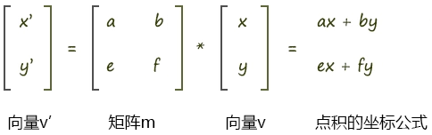

用专业术语来说：

- 横着的两组遵循的规则是行主序，即将矩阵中的一行数据视之为一个向量。
- 竖着的两组遵循的规则是列主序，即将矩阵中的一列数据视之为一个向量。

至于是使用行主序，还是列主序，这就得看规则的定制者了。

在 webgl 里，矩阵元素的排列规则是列主序。

数学中常用的写法是行主序

可以用矩阵乘以向量的方式让点 p 旋转 β 度：

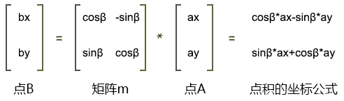

3. 在着色器中写矩阵

```js
<script id="vertexShader" type="x-shader/x-vertex">
    attribute vec4 a_Position;
    float angle=radians(40.0);
    float sinB=sin(angle);
    float cosB=cos(angle);
    mat2 m2=mat2(
      cosB, sinB,
      -sinB,cosB
    );
    void main(){
      gl_Position = vec4(
        m2*vec2(a_Position),
        a_Position.z,a_Position.w
      );
    }
</script>
```

4. 四维矩阵

```js
<script id="vertexShader" type="x-shader/x-vertex">
    attribute vec4 a_Position;
    float angle=radians(10.0);
    float cosB=cos(angle);
    float sinB=sin(angle);
    //列主序
    mat4 m4=mat4(
      cosB, sinB,0.0,0.0,
      -sinB,cosB,0.0,0.0,
      0.0,  0.0, 1.0,0.0,
      0.0,  0.0, 0.0,1.0
    );
    void main(){
      gl_Position = m4*a_Position;
    }
</script>
```

5. 矩阵平移

让顶点的 x 移动 0.1，y 移动 0.2，z 移动 0.3：

```js
<script id="vertexShader" type="x-shader/x-vertex">
    attribute vec4 a_Position;
    //列主序
    mat4 m4=mat4(
      1.0, 0.0, 0.0,0.0,
      0.0, 1.0, 0.0,0.0,
      0.0, 0.0, 1.0,0.0,
      0.1, 0.2, 0.3,1.0
    );
    void main(){
      gl_Position = m4*a_Position;
    }
</script>
```

6. 矩阵缩放

顶点在 x 轴向缩放 2，y 轴向缩放 3，轴向缩放 4：

```js
<script id="vertexShader" type="x-shader/x-vertex">
    attribute vec4 a_Position;
    //列主序
    mat4 m4=mat4(
      2.0, 0.0, 0.0,0.0,
      0.0, 3.0, 0.0,0.0,
      0.0, 0.0, 4.0,0.0,
      0.0, 0.0, 0.0,1.0
    );
    void main(){
      gl_Position = m4*a_Position;
    }
</script>
```

7. 矩阵库

three.js 的 Matrix3 和 Matrix4 对象：

```js
// 1.引入Matrix4对象
import { Matrix4 } from "https://unpkg.com/three/build/three.module.js";

// 2.实例化矩阵对象，在其中写入旋转信息
const matrix = new Matrix4();
matrix.makeRotationZ(Math.PI / 6);

// 3.基于matrix 对象的elements 属性，修改uniform 变量
const u_Matrix = gl.getUniformLocation(gl.program, "u_Matrix");
gl.uniformMatrix4fv(u_Matrix, false, matrix.elements);
```

## 六、 矩阵复合变换

### 1.矩阵相乘

矩阵相乘可以实现复合变换，就比如先位移再旋转、先旋转在位移，或着连续位移。

矩阵乘以矩阵的结果还是矩阵，我们可以通过矩阵库验证一下矩阵相乘的规律。

1. 使用 three.js 的 Matrix4 对象建立矩阵

```json
const a=new Matrix4().set(
    0, 1, 2, 3,
    4, 5, 6, 7,
    8, 9, 10,11,
    12,13,14,15
)
const b=new Matrix4().set(
    0,  10, 20, 30,
    40, 50, 60, 70,
    80, 90, 100,110,
    120,130,140,150
)
```

注：set()方法里输入的矩阵是行主序的，但 elements 输出的矩阵是列主序的。

```json
const ca=a.elements
console.log(ca);
[
    0, 4, 8,  12,
    1, 5, 9,  13,
    2, 6, 10, 14,
    3, 7, 11, 15
]

const cb=b.elements
console.log(cb);
[
    0,  40, 80, 120,
    10, 50, 90, 130,
    20, 60, 100, 140,
    30, 70, 110, 150

```

2. 让矩阵 a 乘以矩阵 b

```json
const c=a.multiply(b)
console.log(c.elements);
[
    560, 1520, 2480, 3440,
    620, 1740, 2860, 3980,
    680, 1960, 3240, 4520,
    740, 2180, 3620, 5060
]
```

分析一下结果

```js
560=0*0 +1*40+2*80 +3*120
620=0*10+1*50+2*90 +3*130
680=0*20+1*60+2*100+3*140
740=0*30+1*70+2*110+3*150

1520=4*0 +5*40+6*80 +7*120
1740=4*10+5*50+6*90 +7*130
……
```

总结出矩阵 a 乘以矩阵 b 规律:

以列主序的 ca、cb 为例：  
先遍历 ca 的每一列，再遍历 cb 的每一行，将 ca 的每一列乘以 cb 的每一行，按照列主序排列后得到的结果。

以行主序的 ca、cb 为例：  
先遍历 ca 的每一行，再遍历 cb 的每一列，将 ca 的每一行乘以 cb 的每一列，按照行主序排列后得到的结果。

验证一下后者：

```json
const cc=[]
for(let y=0;y<16;y+=4){
    const [ax,ay,az,aw]=[ca[y],ca[y+1],ca[y+2],ca[y+3]]
    for (let x=0;x<4;x++){
        console.log(x);
        const [bx,by,bz,bw]=[cb[x],cb[x+4],cb[x+8],cb[x+12]]
        cc.push(ax*bx+ay*by+az*bz+aw*bw)
    }
}
console.log(cc);
[
    560, 1520, 2480, 3440,
    620, 1740, 2860, 3980,
    680, 1960, 3240, 4520,
    740, 2180, 3620, 5060
]
```

### 2.变换规律

1. 位移加位移

接下来我想让一个物体沿 x 轴位移 ax，沿 y 轴位移 ay 后，再沿 x 轴位移 bx，沿 y 轴位移 by。

已知：

- 初始点位 A(ax,ay,az,1.0)
- 初次位移：沿 x 轴位移 bx，沿 y 轴位移 by
- 第二次位移：沿 x 轴位移 cx，沿 y 轴位移 cy

求：变换后的位置 F(fx,fy,fz,fw)

解：

1.设初次变换矩阵为 bm(行主序)：

```json
bm
[
	1.0,0.0,0.0,bx,
	0.0,1.0,0.0,by,
	0.0,0.0,1.0,0.0,
	0.0,0.0,0.0,1.0,
]
```

则初次变换后的点 F 为：

```js
F = bm * A;
fx = (1.0, 0.0, 0.0, bx) * (ax, ay, az, 1.0) = ax + bx;
fy = (0.0, 1.0, 0.0, by) * (ax, ay, az, 1.0) = ay + by;
fz = (0.0, 0.0, 1.0, 0.0) * (ax, ay, az, 1.0) = az;
fw = (0.0, 0.0, 0.0, 1.0) * (ax, ay, az, 1.0) = 1.0;
```

2.设第二次变换矩阵为 cm(行主序)：

```json
cm
[
	1.0,0.0,0.0,cx,
	0.0,1.0,0.0,cy,
	0.0,0.0,1.0,0.0,
	0.0,0.0,0.0,1.0,
]
```

则第二次变换后的点 F 为第二次变换矩阵乘以上一次变换后的点 F：

```js
F = cm * F;
fx = (1.0, 0.0, 0.0, cx) * (fx, fy, fz, 1.0) = fx + cx;
fy = (0.0, 1.0, 0.0, cy) * (fx, fy, fz, 1.0) = fy + cy;
fz = (0.0, 0.0, 1.0, 0.0) * (fx, fy, fz, 1.0) = fz;
fw = (0.0, 0.0, 0.0, 1.0) * (fx, fy, fz, 1.0) = 1.0;
```

所以理解最终的点 F：

```js
fx = ax + bx + cx;
fy = ay + by + cy;
fz = az;
fw = 1.0;
```

上面的点 F 还可以这么理解：（矩阵乘以矩阵）

```js
F = cm * bm * A;
```

设 cm\*bm 的结果为矩阵 dm(行主序)，参照 dm 中元素的索引位置：

```json
cm
[
    0, 1, 2, 3,
	4, 5, 6, 7,
	8, 9,10,11,
	12,13,14,15,
]
```

则 dm 中的第一行元素为：

```js
dm[0] = (1.0, 0.0, 0.0, bx) * (1.0, 0.0, 0.0, 0.0) = 1.0;
dm[1] = (1.0, 0.0, 0.0, bx) * (0.0, 1.0, 0.0, 0.0) = 0.0;
dm[2] = (1.0, 0.0, 0.0, bx) * (0.0, 0.0, 1.0, 0.0) = 0.0;
dm[3] = (1.0, 0.0, 0.0, bx) * (cx, cy, 0.0, 1.0) = cx + bx;
```

通过 dm 矩阵的第一行元素我们就可以得到点 F 的 fx 值了，我们验证一下：

```js
fx = (1.0, 0.0, 0.0, cx + bx) * (ax, ay, az, 1.0) = ax + cx + bx;
```

这和我们之前两次矩阵乘以向量得到的结果是一样的。

2. 先移动后旋转

```js
const mr = new Matrix4();
mr.makeRotationZ(Math.PI / 4);

const mt = new Matrix4();
mt.makeTranslation(0.3, 0, 0);

const matrix = mr.multiply(mt);
const u_Matrix = gl.getUniformLocation(gl.program, "u_Matrix");
gl.uniformMatrix4fv(u_Matrix, false, matrix.elements);
```

mr.multiply(mt) 便是先位移再旋转：  


3. 先旋转后移动

```js
const mr = new Matrix4();
mr.makeRotationZ(Math.PI / 4);

const mt = new Matrix4();
mt.makeTranslation(0.3, 0, 0);

const matrix = mt.multiply(mr);
const u_Matrix = gl.getUniformLocation(gl.program, "u_Matrix");
gl.uniformMatrix4fv(u_Matrix, false, matrix.elements);
```

mt.multiply(mr)便是先旋转再位移：  
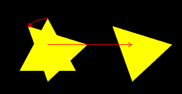

4. 其它变换方式

1)旋转和缩放

- 先旋转后缩放

```js
const mr = new Matrix4();
mr.makeRotationZ(Math.PI / 4);

const ms = new Matrix4();
ms.makeScale(2, 0.5, 1);

const matrix = ms.multiply(mr);
const u_Matrix = gl.getUniformLocation(gl.program, "u_Matrix");
gl.uniformMatrix4fv(u_Matrix, false, matrix.elements);
```

- 先缩放后旋转

```js
const matrix = mr.multiply(ms);
```

在此要注意一个性质：当缩放因子一致时，旋转和缩放没有先后之分。

```js
const ms = new Matrix4();
ms.makeScale(2, 2, 2);
```

此是下面的两种变换结果都是一样的:

```js
const matrix = ms.multiply(mr);
const matrix = mr.multiply(ms);
```

2)综合变换

Matrix4 还有一个 compose 综合变换方法，它可以将所有变换信息都写进去，其变换顺序就是先缩放，再旋转，最后位移。

```js
const matrix = new Matrix4();
//位移
const pos = new Vector3(0.3, 0, 0);
//旋转
const rot = new Quaternion();
rot.setFromAxisAngle(new Vector3(0, 0, 1), Math.PI / 4);
//缩放
const scale = new Vector3(2, 0.5, 1);
matrix.compose(pos, rot, scale);
const u_Matrix = gl.getUniformLocation(gl.program, "u_Matrix");
gl.uniformMatrix4fv(u_Matrix, false, matrix.elements);
```

compose ( position : Vector3, quaternion : Quaternion, scale : Vector3 )

- position 位置
- quaternion 用四元数存储的旋转数据
- scale 缩放

compose() 方法分解开来，就是这样的：

```js
const mt = new Matrix4();
mt.makeTranslation(0.3, 0, 0);

const mr = new Matrix4();
mr.makeRotationZ(Math.PI / 4);

const ms = new Matrix4();
ms.makeScale(2, 0.5, 1);

const matrix = mt.multiply(mr).multiply(ms);
const u_Matrix = gl.getUniformLocation(gl.program, "u_Matrix");
gl.uniformMatrix4fv(u_Matrix, false, matrix.elements);
```

### 3.视图矩阵

视图矩阵是用于确定相机角度和位置的矩阵，最终改变的是场景中的物体

#### 1.相机的定义

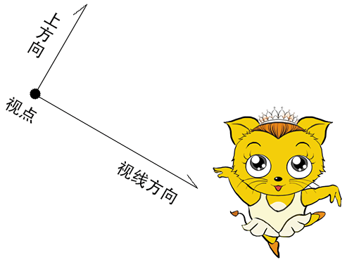

- 视点：相机的位置
- 视线方向：相机所看的方向
- 上方向：相机绕视线转动的方向

#### 2.相对运动

当相机与它所拍摄的物体同时运动的时候，相机所拍摄的画面不会有任何改变

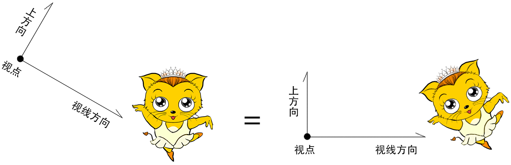

因此，我们可以默认相机的视点就在零点，相机看向-z 方向，其上方向就是 y 轴。  
当我我们改变的相机的视点、视线和上方向的时候，只要相对的去改变场景中的物体即可。  
而这个相对的去改变场景中的物体的矩阵，就是视图矩阵。

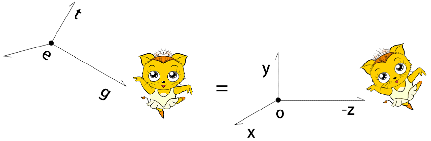

通过上面原理可以知道，想要计算视图矩阵，让其满足以下条件即可：

1. 把视点 e(ex,ey,ez)对齐到 O 点上
2. 把视线 c(cx,cy,cz) 旋转到-z 轴上
3. 把上方向 b(bx,by,bz) 旋转到 y 轴上
4. 把 c 与 b 的垂线 a(ax,ay,az) 旋转到 x 轴上

#### 3.正交矩阵的旋转

为了理解视图矩阵的运算，从几个例题说起。

题 1  
已知：点 A(1,0,0)  
求：把点 A 绕 z 轴逆时针旋转 30°，旋转到 B 点的行主序矩阵 m1  
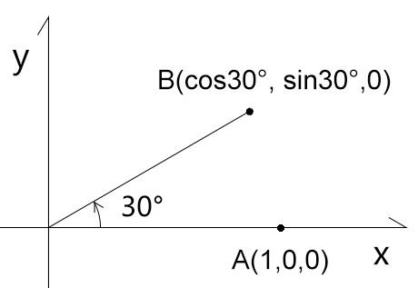

```js
m1=[
	cos30°,-sin30°,0,0,
	sin30°,cos30°, 0,0,
	0,     0,      1,0,
	0,     0,      0,1,
]
B=m1*A
B.x=(cos30°,-sin30°,0,0)·(1,0,0,1)=cos30°
B.y=(sin30°,cos30°, 0,0)·(1,0,0,1)=sin30°
```

题 2  
继题 1 的已知条件  
求：把点 B 绕 z 轴逆时针旋转-30°，旋转到 A 点的列行序矩阵 m2

```js
m2=[
	cos-30°,-sin-30°,0,0,
	sin-30°,cos-30°, 0,0,
	0,      0,       1,0,
	0,      0,       0,1,
]
m2=[
	cos30°, sin30°,  0,0,
	-sin30°,cos30°,  0,0,
	0,      0,       1,0,
	0,      0,       0,1,
]
```

观察题 1、题 2，我们可以发现两个规律：

- m2 是 m1 的逆矩阵
- m2 也是 m1 的转置矩阵

由此我们可以得到一个结论：**正交旋转矩阵的逆矩阵就是其转置矩阵**。

题 3  
已知：

- 三维直角坐标系 m1，其基向量是：

  - x(1,0,0)
  - y(0,1,0)
  - z(0,0,1)

- 三维直角坐标系 m2，其基向量是：
  - x(cos30°, sin30°,0)
  - y(-sin30°,cos30°,0)
  - z(0, 0, 1)

求：将 m1 中的基向量对齐到 m2 的行主序矩阵 m3  


解：

将 m2 的基向量 x,y,z 中的 x 分量写入 m3 第 1 行;  
将 m2 的基向量 x,y,z 中的 y 分量写入 m3 第 2 行;  
将 m2 的基向量 x,y,z 中的 z 分量写入 m3 第 3 行。

```js
m3=[
	cos30°,-sin30°,0,0,
	sin30°,cos30°, 0,0,
	0,     0,      1,0,
	0,     0,      0,1,
]
```

题 4  
继题 3 的已知条件  
求：将 m2 中的基向量对齐到 m1 的行主序矩阵 m4

解：  
由题 3 已知：将 m1 中的基向量对齐到 m2 的行主序矩阵是 m3  
由题 4 的问题可知：m4 就是 m3 的逆矩阵  
因为：正交旋转矩阵的逆矩阵就是其转置矩阵  
所以：m4 就是 m3 的转置矩阵

```js
m3=[
	cos30°,-sin30°,0,0,
	sin30°,cos30°, 0,0,
	0,     0,      1,0,
	0,     0,      0,1,
]
m4=[
	cos30°,sin30°,0,0,
	-sin30°,cos30°,0,0,
	0,0,1,0,
	0,0,0,1
]
```

#### 4.计算视图矩阵


1. 先位移：写出把视点 e(ex,ey,ez) 对齐到 O 点上的行主序位移矩阵 mt

```json
mt
mt=[
  1,0,0,-ex,
  0,1,0,-ey,
  0,0,1,-ez,
  0,0,0,1,
]
```

2. 写出把{o;x,y,-z} 对齐到{e;a,b,c} 的行主序旋转矩阵 mr1

把 a,b,-c 的 x 分量写入 mr1 的第 1 行；  
​ 把 a,b,-c 的 y 分量写入 mr1 的第 2 行；  
​ 把 a,b,-c 的 z 分量写入 mr1 的第 3 行；

```json
mr1
mr1=[
	 ax, bx, -cx, 0,
	 ay, by, -cy, 0,
	 az, bz, -cz, 0,
	 0,  0,   0,  1
]
```

3. 计算 mr1 的逆矩阵 mr2。

因为正交旋转矩阵的逆矩阵就是其转置矩阵，所以 mr2 就是 mr1 的转置矩阵。

```json
mr2
mr2=[
	 ax, ay, az, 0,
	 bx, by, bz, 0,
	-cx,-cy,-cz, 0,
	 0,  0,   0, 1
]
```

4. 视图投影矩阵=mr2\*mt

#### 5.视图矩阵的代码实现


基于视点、目标点、上方向生成视图矩阵。

```json
getViewMatrix 相当于 threeJS 的 lookAt 方法
function getViewMatrix(e, t, u) {
  //基向量c，视线
  const c = new Vector3().subVectors(e, t).normalize()
  //基向量a，视线和上方向的垂线
  const a = new Vector3().crossVectors(u, c).normalize()
  //基向量b，修正上方向
  const b = new Vector3().crossVectors(c, a).normalize()
  //正交旋转矩阵
  const mr = new Matrix4().set(
    ...a, 0,
    ...b, 0,
    -c.x, -c.y, -c.z, 0,
    0, 0, 0, 1
  )
  //位移矩阵
  const mt = new Matrix4().set(
    1, 0, 0, -e.x,
    0, 1, 0, -e.y,
    0, 0, 1, -e.z,
    0, 0, 0, 1
  )
  return mr.multiply(mt).elements
}
```

getViewMatrix 方法就是从一个新的角度去看某一个东西的意思

- e 视点
- t 目标点
- u 上方向

在其中我借助了 Three.js 的 Vector3 对象

- subVectors(e, t) 向量 e 减向量 t
- normalize() 向量的归一化
- crossVectors(u, d) 向量 u 和向量 d 的叉乘

```js
crossVectors( a, b ) {
  const ax = a.x, ay = a.y, az = a.z;
  const bx = b.x, by = b.y, bz = b.z;
  this.x = ay * bz - az * by;
  this.y = az * bx - ax * bz;
  this.z = ax * by - ay * bx;
  return this;
}
```

解释一下上面基向量 a,b,c 的运算原理，以下图为例：

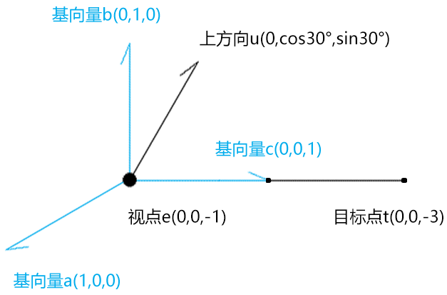

视线 c 之所以是视点 e 减目标点 t，是为了取一个正向的基向量。

```js
c=(e-t)/|e-t|
c=(0,0,2)/2
c=(0,0,1)
```

基向量 a 是上方向 u 和向量 c 的叉乘

```js
a=u^c/|u^c|
a=(cos30°,0,0)/cos30°
a=(1,0,0)
```

基向量 b 是向量 c 和向量 a 的叉乘，可以理解为把上方向摆正

```js
b=c^a/|c^a|
b=(0,1,0)/1
b=(0,1,0)
```

#### 6.测试

1. 顶点着色器

```js
<script id="vertexShader" type="x-shader/x-vertex">
    attribute vec4 a_Position;
    //视图矩阵
    uniform mat4 u_ViewMatrix;
    void main(){
      gl_Position = u_ViewMatrix*a_Position;
    }
</script>
```

2. 建立视图矩阵，并传递给顶点着色器

```js
const u_ViewMatrix = gl.getUniformLocation(gl.program, "u_ViewMatrix");
const viewMatrix = getViewMatrix(
  new Vector3(0.3, 0.2, 0.5),
  new Vector3(0.0, 0.1, 0),
  new Vector3(0, 1, 0)
);
gl.uniformMatrix4fv(u_ViewMatrix, false, viewMatrix);
```

注：

three.js 里的 lookAt() 方法便可以实现矩阵的正交旋转，其参数也是视点、目标点、上方向，它的实现原理上面说的是一样的。

```js
const u_ViewMatrix = gl.getUniformLocation(gl.program, "u_ViewMatrix");
const viewMatrix = new Matrix4().lookAt(
  new Vector3(0.5, 0.5, 1),
  new Vector3(0, 0, 0),
  new Vector3(0, 1, 0)
);
gl.uniformMatrix4fv(u_ViewMatrix, false, viewMatrix.elements);
```

### 4.模型矩阵

模型矩阵可以对物体进行位移、旋转、缩放变换，比如我们想让物体沿 z 旋转

代码实现：

1. 在顶点着色器中添加一个模型矩阵

```js
<script id="vertexShader" type="x-shader/x-vertex">
    attribute vec4 a_Position;
    //模型矩阵
    uniform mat4 u_ModelMatrix;
    //视图矩阵
    uniform mat4 u_ViewMatrix;
    void main(){
      gl_Position = u_ViewMatrix*u_ModelMatrix*a_Position;
    }
</script>
```

2. 在 js 中建立模型矩阵，并传递给顶点着色器

```js
const u_ModelMatrix = gl.getUniformLocation(gl.program, "u_ModelMatrix");
const u_ViewMatrix = gl.getUniformLocation(gl.program, "u_ViewMatrix");

const modelMatrix = new Matrix4();
const viewMatrix = new Matrix4().lookAt(
  new Vector3(0, 0.25, 1),
  new Vector3(0, 0, 0),
  new Vector3(0, 1, 0)
);

gl.uniformMatrix4fv(u_ModelMatrix, false, modelMatrix.elements);
gl.uniformMatrix4fv(u_ViewMatrix, false, viewMatrix.elements);
```

3. 添加一个旋转动画

```js
let angle = 0;
!(function ani() {
  angle += 0.02;
  modelMatrix.makeRotationY(angle);
  gl.uniformMatrix4fv(u_ModelMatrix, false, modelMatrix.elements);

  gl.clear(gl.COLOR_BUFFER_BIT);
  gl.drawArrays(gl.LINES, 0, indices.length);
  requestAnimationFrame(ani);
})();
```

4. 还可以来个弹性动画

```js
let angle = 0;

const minY = -0.7;
const maxY = 0.7;
let y = maxY;
let vy = 0;
const ay = -0.001;
const bounce = 1;

!(function ani() {
  angle += 0.01;
  vy += ay;
  y += vy;
  modelMatrix.makeRotationY(angle);
  modelMatrix.setPosition(0, y, 0);
  if (modelMatrix.elements[13] < minY) {
    y = minY;
    vy *= -bounce;
  }

  gl.uniformMatrix4fv(u_ModelMatrix, false, modelMatrix.elements);
  gl.clear(gl.COLOR_BUFFER_BIT);
  gl.drawArrays(gl.LINES, 0, indices.length);
  requestAnimationFrame(ani);
})();
```
