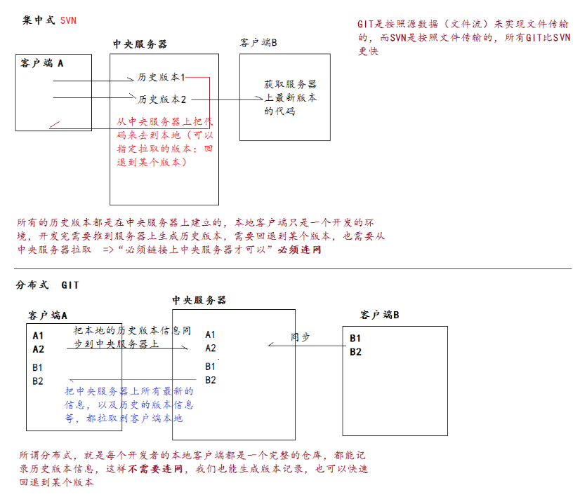
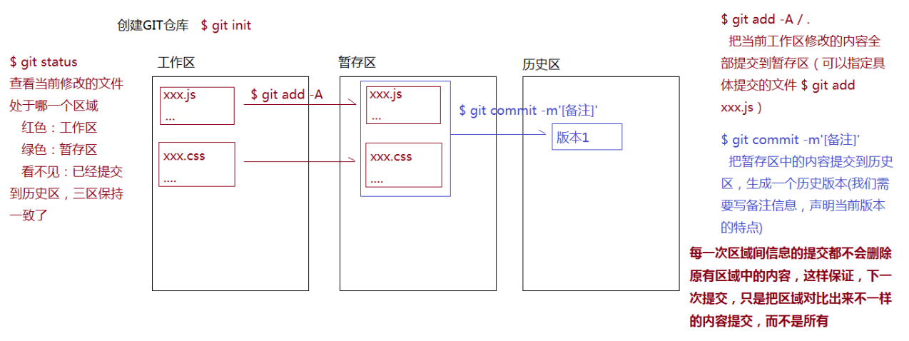
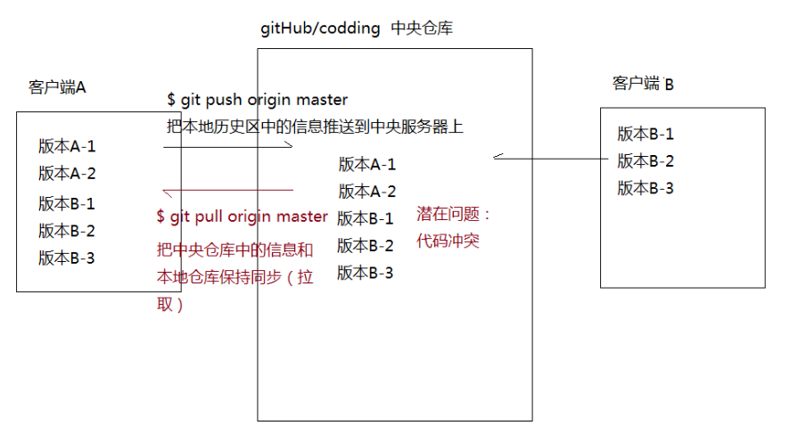
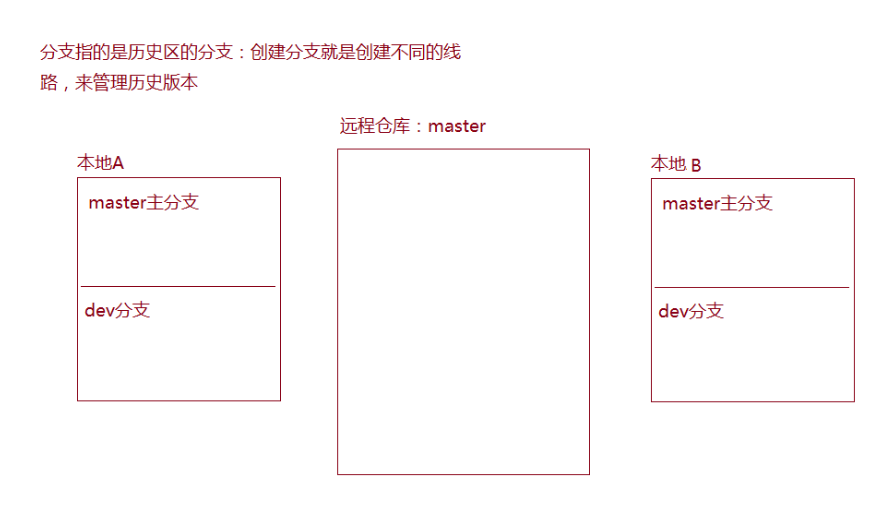

## 1-GIT分布式版本控制系统
  1. 版本控制系统
    开发中我们把每一次的修改都有效的进行记录（记录成一个版本），后期如果需要回退到原有的某个版本或者是用当前的和某一个版本进行比较等，都可以有效的进行管理  
  
  **常用的版本控制系统：SVN(集中式) / GIT(分布式)**
  

  2. 分布式版本管理系统的特点

  3. Linux团队开发的git，所以git中的命令大部分都是linux命令

## 2-简单的LINUX命令
  WINDOWS操作系统：DOS窗口和DOS命令  
  LINUX服务器操作系统：LINUX命令 （MAC的终端使用的也是LINUX命令）

```bash
ls -l/-a：查看当前目录结构（-a是可以看见所有的：包含隐藏的）

cd xxx[路径地址]：进入到执行的文件夹中（进入的路径地址，可以粘贴到对应的操作命令窗口中）
  cd /：根目录
  cd ./：当前目录
  cd ../：上级目录

clear：清屏

exit: 退出

mkdir：创建文件夹

touch：创建空的文件

echo：向指定的文件中输入内容
  echo xxx > xxx.txt  或者 echo xxx>>xxx.txt

cat：查看文件中的内容

vi xxx：向文件中插入或者编辑一些内容
  i：进入到插入模式
  ESC + :wq ：退出内容的插入模式，把刚才编辑的内容进行保存
  ESC + :q! ：退出内容的插入模式，当前内容不保存

cp：拷贝

rm：删除文件  -r（递归删除）-f（强制删除），一旦删除无法还原
  rm node_modules -rf (删除node_modules所有内容)
```

## 3-GIT的常规流程
  1. 每一个GIT仓库都有三个区：  
  工作区：写代码  
  暂存区：临时存放每一次修改的代码，但是并没有生成历史版本  
  历史区：存放所有历史版本的地方(提交到历史区就会生成历史版本)
  

  2. 把暂存区的文件删除（不会覆盖工作区新写的内容，需求不多，直接再提交一次到暂存区就会覆盖）
  ```bash
    $ git rm --cached xxx.xx  把暂存区的某一个文件删除
    $ git rm --cached . -r    删除暂存区中所有提交的文件 

    如果在删除过程中，发现从暂存区删除的文件，在工作区已经被修改了，只有加上 -f 才能强制从暂存区把内容删除掉
  ```

  3. 提交到暂存区后，工作区内容改了，修改的东西不好，把暂存区上次提交的内容撤回到工作区（覆盖工作区新写的内容）
  ```bash
    $ git checkout <file>
    $ git checkout .  

    暂存区内容没有消失，只是把工作去最新修改的信息给覆盖了，让工作区和暂存区保持一致
  ```

## 4-细节问题
  1. 如果是第一次使用git，生成历史版本的时候，需要提供身份认证
  ```bash
    只需要在本地GIT全局环境下配置一些信息即可
    $ git config -l   查看全局配置信息
    $ git config --global user.name 'xxx'
    $ git config --global user.eamil 'xxx'
  ```

  2. 真实项目中，并不是所有的文件都和项目有关系（例如：.idea是WS生成的配置文件夹和项目没关系）  
  也不是所有的文件都提交（例如：node_modules中的内容太大了，也不需要提交）

  .gitignore => GIT提交的忽略文件
  ```bash
    # dependencies
    /node_modules

    # testing
    /coverage

    # production
    /build

    # misc
    .DS_Store
    .env.local
    .env.development.local
    .env.test.local
    .env.production.local

    npm-debug.log*
    yarn-debug.log*
    yarn-error.log*

    .idea
  ```

  3.$ git log 查看历史版本信息

## 5-GIT常用命令
```bash
  $ git init          初始化仓库
  $ git add .         提交到暂存区
  $ git commit -m''   提交到历史区
  $ git status        查看文件状态
  $ git log           查看历史版本信息
  $ git reflog        查看历史版本信息（包括历史区回滚后）
  $ git checkout .    把暂存区的内容回滚到工作区（一旦回滚，工作区的内容无法恢复）
  $ git reset --hard 版本号(7位)   在历史区中回退到某一个版本（强制把暂存区和工作区都变成回退后的版本）
  $ history > <file>  生成一个历史记录文件
```

## 6-团队协作开发
**一、基础流程操作：**
1. 首先创建中央仓库:可以基于gitHub/codding来创建（最好不要创建空仓库，因为空仓库中没有任何分支，只有提交一次历史信息才会生成MASTER分支）

>把开发者都列入仓库的开发群组中，这样每一个开发者用自己的gitHub账号，都有权限操作这个仓库了  
>=>（当然不这样做也可以，所有开发者用统一的一个账号也可以，为了防止不知道是谁提交的，我们需要让每一个客户端在本地的GIT全局配置中，设置和gitHub相同的用户名和邮箱 $ git config --global user.name 'xxx' ...） 

2. 创建客户端本地仓库（一个开发者就是一个单独仓库），让本地的仓库和远程仓库保持关联，可以实现后续的信息同步
```bash
$ git init                               =>创建本地仓库
$ git remote add origin “远程仓库GIT地址” =>让本地仓库和远程仓库保持连接
$ git remote -v                          =>查看连接信息（origin是连接的名称，一般都用这个名字，也可以随便设置）
$ git remote rm origin                   =>移除本地仓库和远程仓库的链接
$ git remote update origin               =>更新链接通道

更简单的方式：把远程仓库克隆到本地          => 创建本地仓库，自动建立了链接，也把远程仓库中的内容同步到本地
$ git clone “远程仓库地址” “本地仓库文件夹名字（不写默认是仓库名字）”
```

3. 各自和中央服务器同步信息
```bash
推送：$ git push origin master   （每一次PUSH之前最好都PULL一下：如果有冲突在本地处理一下冲突，然后再推送）
拉取：$ git pull origin master
```

**二、团队协作和分支处理：**
1. 无分支管理模式   
所有人使用的都是master分支，每天上班的第一件事, 以及每天提交自己代码的时候，第一件事情就是先拉取
```bash
  $ git pull origin master    => 把远程仓库MASTER中的信息同步到本地仓库MASTER中

  $ git push origin master    => 把本地仓库MASTER中的信息同步到远程仓库MASTER中  
  （需要使用gitHub的用户密码来进行权限校验：一般都是组长在远程仓库中把组员的账号都放到小组中，  
  这样组员用自己的账号也有权限操作仓库了，最好在本地的GIT配置中把用户名和邮箱修改为和gitHub账号相同的信息）

  代码冲突：
     1.同一行冲突：进入到了编辑框模式，i->ESC->:wq 即可 (一般wq是保留中央，q直接退出保留本地)
     2.不是同一行代码冲突：自己会把两份代码都保存在本地文件中，自己手动去选择要哪一个，改完后重新提交即可
```


2. 单独分支管理模式   
每天第一件事是把远程master内容拉取到本地master上（提交之前也是），每个人在自己本地仓库中，先进行分支创建和切换
```bash
  $ git branch            => 查看当前存在的分支，* master 星代表当前在哪个分支上
  $ git branch xxx        => 创建一个叫做xxx的分支 （创建分支完成，会把本地的master分支中的内容同步到xxx分支上）  
  $ git checkout xxx      => 切换到xxx分支上
  $ git branch -D xxx     => 删除分支
  
  $ git checkout -b dev   => 创建dev分支并且切换到dev分支下（可以把本地master中的历史信息同步到新创建的dev分支中）

  $ git stash             => 在切换到master之前，有一部分信息并没有提交成为历史版本，为了防止信息的丢失， 
  $ git stash pop         => 在切换到master之后，基于stash pop还原 

  $ git merge xxx         => 把xxx分支的历史信息合并到当前分支下(有代码冲突按照之前的规则修改)

  $ git pull origin master
  $ git push origin master
```



